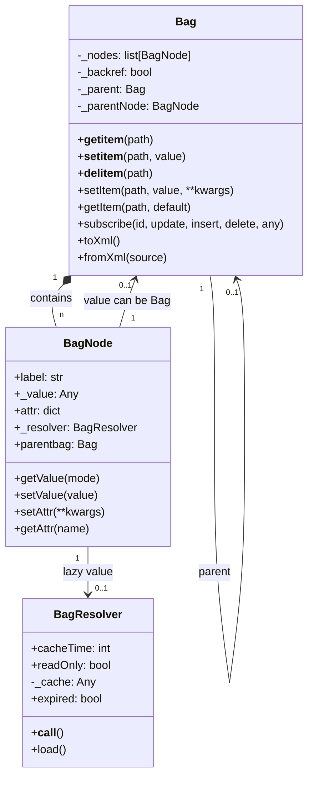
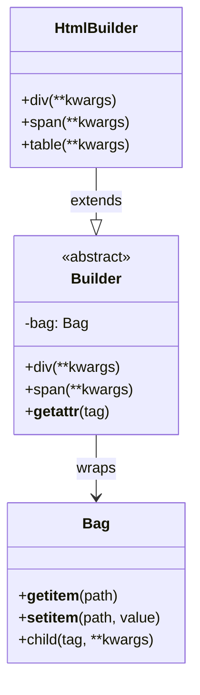
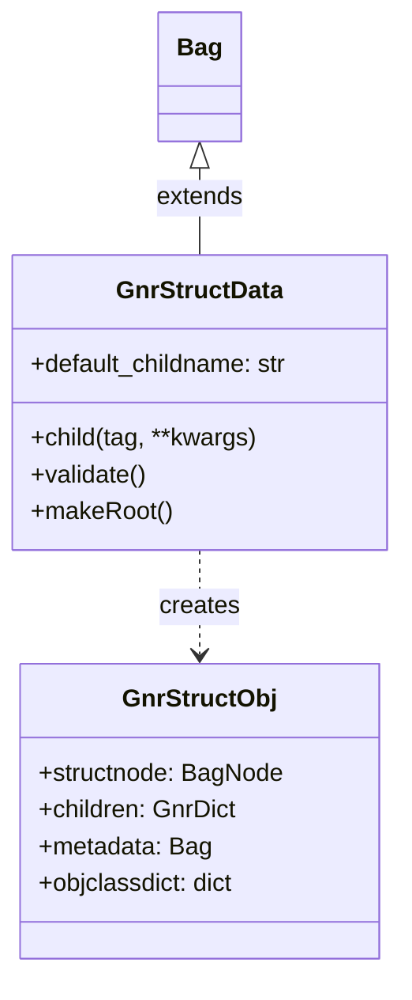
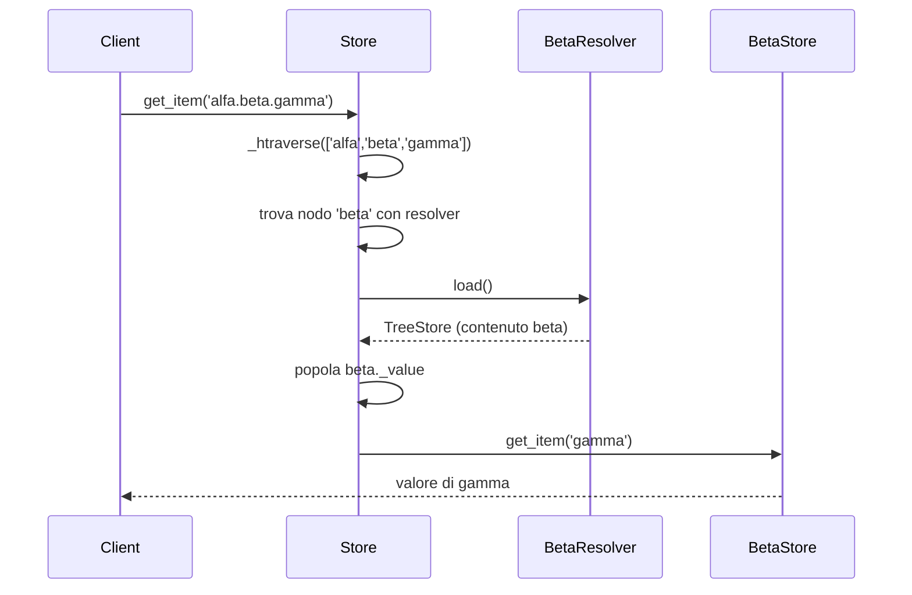
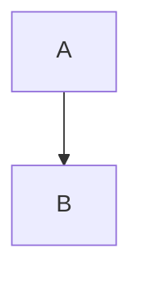

# Project Startup Info

## Obiettivo

Riscrivere una versione moderna di `gnrbag.py` e `gnrstructures.py` mantenendo retrocompatibilità tramite un layer di adattamento in Genropy legacy.

---

## Sorgenti di Riferimento

### Codice Originale Genropy

- **gnrbag.py**: `/Users/gporcari/Sviluppo/Genropy/genropy/gnrpy/gnr/core/gnrbag.py`
- **gnrstructures.py**: `/Users/gporcari/Sviluppo/Genropy/genropy/gnrpy/gnr/core/gnrstructures.py`

### Tentativo Precedente

- **genro-treestore docs**: `/Users/gporcari/Sviluppo/genro_ng/meta-genro-modules/sub-projects/genro-treestore/docs`

---

## Sintesi Architettura Originale (gnrbag.py)

### Classi Principali



### Concetti Chiave

#### 1. BagNode
Elemento atomico con:
- **label**: chiave/nome del nodo
- **value**: valore (può essere Bag per gerarchia, o BagResolver per lazy)
- **attr**: dizionario di attributi/metadata

#### 2. Dual Mode (backref)
- `backref=False` (default): Lightweight, no trigger, performance ottimale
- `backref=True`: Strict tree, eventi propagati UP, una sola parent

#### 3. Path Syntax
```python
bag['a.b.c']        # Percorso gerarchico
bag['a.#2']         # Indice numerico (0-based)
bag['a?attr']       # Accesso attributo
bag['../sibling']   # Parent traversal
```

#### 4. Lazy Loading (BagResolver)
```python
# cacheTime semantica:
#   0  = sempre ricalcola (no cache)
#   >0 = cache per N secondi (TTL)
#   <0 = cache infinito
```

#### 5. Trigger System
- Eventi: `update`, `insert`, `delete`
- Propagazione: bottom-up (da nodo modificato verso root)
- Subscription: `bag.subscribe(id, update=callback)`

#### 6. Serializzazione XML
- `toXml()`: Bag → XML string
- `fromXml(source)`: XML → Bag
- Type preservation con attributo `T` (es. `T="L"` per long)

---

## Sintesi gnrstructures.py

### Il Problema: Builder Integrato nella Bag

In Genropy legacy, `GnrStructData` estende `Bag` per aggiungere una **sintassi funzionale** per costruire strutture HTML/XML:

```python
# Approccio legacy: metodi tag sulla classe stessa
class GnrStructData(Bag):
    def div(self, **kwargs):
        return self.child('div', **kwargs)
    def span(self, **kwargs):
        return self.child('span', **kwargs)
    # ... centinaia di metodi per ogni tag HTML/XML
```

**Problemi di questo approccio:**

1. **Affollamento namespace**: Ogni tag HTML/XML diventa un metodo (`div`, `span`, `table`, `input`...)
2. **Collisioni**: Metodi come `input()`, `object()`, `filter()` collidono con built-in o utility
3. **Non scala**: Aggiungere nuovi tag richiede modificare la classe
4. **IDE unfriendly**: Autocompletamento mostra centinaia di metodi tag mescolati con API reale

### La Soluzione: Builder Separato



**Vantaggi:**

- Bag rimane **pulita** con solo API dict-like
- Builder è **composable** e **sostituibile**
- **Namespace separati**: metodi tag nel builder, utility nella Bag
- **Validazione tipizzata**: ogni builder conosce i suoi tag validi

### Meccanismo child() Originale

Il metodo `child()` di `GnrStructData` (linea 154-219) fa:

1. **Auto-naming** con pattern `*_#`:
   - `*` → sostituito con tag
   - `#` → sostituito con indice corrente
   - Es: `div_0`, `div_1`, `span_0`

2. **Percorsi dotted**: `childname='parent.child.grandchild'`

3. **Attributo `tag`** separato da `label`:
   - `label`: chiave nel dizionario (es. `div_0`)
   - `tag`: tipo dell'elemento (es. `div`)

4. **Validazione** con `@valid_children`:

```python
@valid_children(div='0:', span='1:5')  # div: 0+, span: 1-5
def container(self, ...):
    ...
```

### GnrStructObj (per reference)



- **GnrStructData**: Bag + sintassi funzionale + validazione
- **GnrStructObj**: Albero di oggetti Python costruito da una Bag strutturata
- **@valid_children**: Decoratore per vincoli cardinalità parent-child

---

## Sintesi Tentativo genro-treestore

### Decisioni Architetturali

1. **Rename**: `Bag` → `TreeStore`, `BagNode` → `TreeStoreNode`
2. **Builder Pattern**: `@element` decorator per tag tipizzati
3. **TYTX Format**: Serializzazione type-preserving (JSON/MessagePack)
4. **Path syntax unificata**: Supporto indici negativi (`#-1`)

### Stato
- Documentazione completa (14 documenti)
- Architettura ben definita
- Edge cases e performance non documentati

---

## Decisioni Già Prese

| Decisione | Scelta |
|-----------|--------|
| Retrocompatibilità | Via layer di adattamento in Genropy legacy |
| Libertà di design | Sì, API può essere moderna/pulita |
| Builder separato | Builder come classe esterna, Bag rimane pulita |

---

## Asset da Recuperare da genro-treestore

I seguenti componenti vanno portati in genro-bag:

### Builder System

| File | Descrizione |
|------|-------------|
| `builders/base.py` | `BuilderBase` con validazione strutturale |
| `builders/decorators.py` | `@element` decorator per tag tipizzati |
| `builders/html.py` | `HtmlBuilder` dinamico per HTML5 |
| `builders/xsd/xsd_schema.py` | `XsdBuilder` da schema XSD |

### Schema HTML5

| File | Descrizione |
|------|-------------|
| `scripts/build_html5_schema.py` | Script RNC → MessagePack |
| `builders/schemas/html5_schema.msgpack` | Schema pre-compilato (112 tag) |

### Resolver System

| File | Descrizione |
|------|-------------|
| `resolvers/base.py` | `TreeStoreResolver` con async trasparente |
| `resolvers/directory.py` | `DirectoryResolver` per filesystem lazy |

---

## Pattern Chiave da Preservare

### Resolver Async con @smartasync

```python
class TreeStoreResolver:
    @smartasync
    async def load(self) -> Any:
        """Trasparenza sync/async automatica."""
        raise NotImplementedError

    def _htraverse(self, remaining_path: str | None = None) -> Any:
        """Risolve e continua traversal se path rimanente."""
        result = self.load()  # smartasync gestisce sync/async
        if remaining_path and hasattr(result, "get_item"):
            return result.get_item(remaining_path)
        return result
```

### htraverse con Resolver

Quando `store['alfa.beta.gamma']` e `beta` ha resolver:



### Cardinality Validation

```python
@element(children='section, item[1:]')  # section: any, item: almeno 1
def menu(self, target, tag, **attr):
    return self.child(target, tag, **attr)

# Sintassi cardinality:
# tag[n]   = esattamente n
# tag[n:]  = almeno n
# tag[:m]  = al massimo m
# tag[n:m] = tra n e m
```

---

## Domande Aperte

### 2. Naming
Mantenere `Bag`/`BagNode` o preferire `TreeStore`/`TreeStoreNode`?

### 3. Base di Partenza
Il tentativo genro-treestore va considerato come base o si riparte da zero?

### 4. Scope Iniziale
Quali funzionalità sono prioritarie?
- [ ] Core (get/set/del, path navigation)
- [ ] Attributi
- [ ] Resolver/lazy loading
- [ ] Trigger/subscriptions
- [ ] Serializzazione XML
- [ ] Validazione

### 5. Dipendenze
Il nuovo genro-bag deve essere standalone o può dipendere da altri genro-* (es. genro-toolbox)?

---

## Note Tecniche

### Mermaid in Sphinx
Usare blocchi code fence:
~~~markdown

~~~

### Documenti Correlati
- [gnrbag.py analysis](./gnrbag_analysis.md) (da creare se necessario)
- [genro-treestore docs](/Users/gporcari/Sviluppo/genro_ng/meta-genro-modules/sub-projects/genro-treestore/docs)
