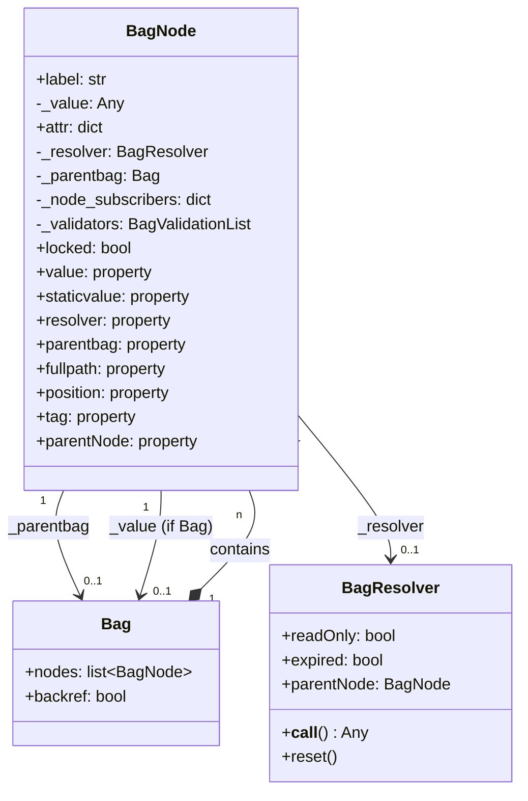
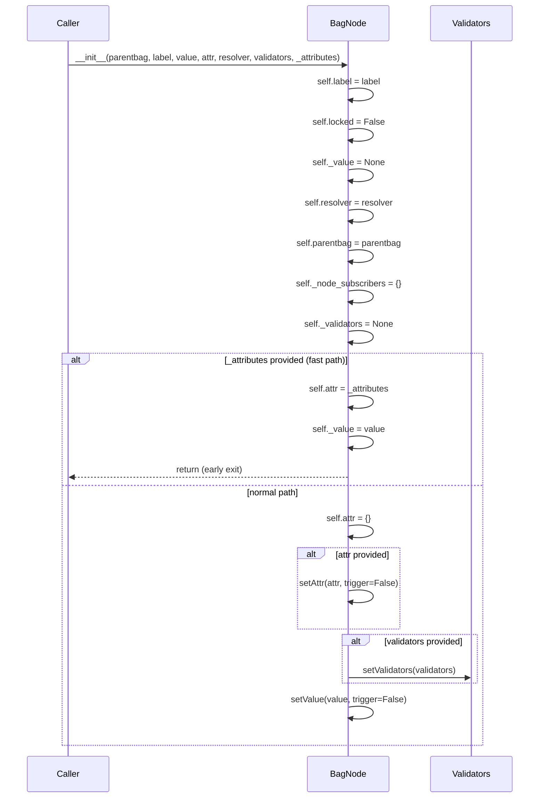
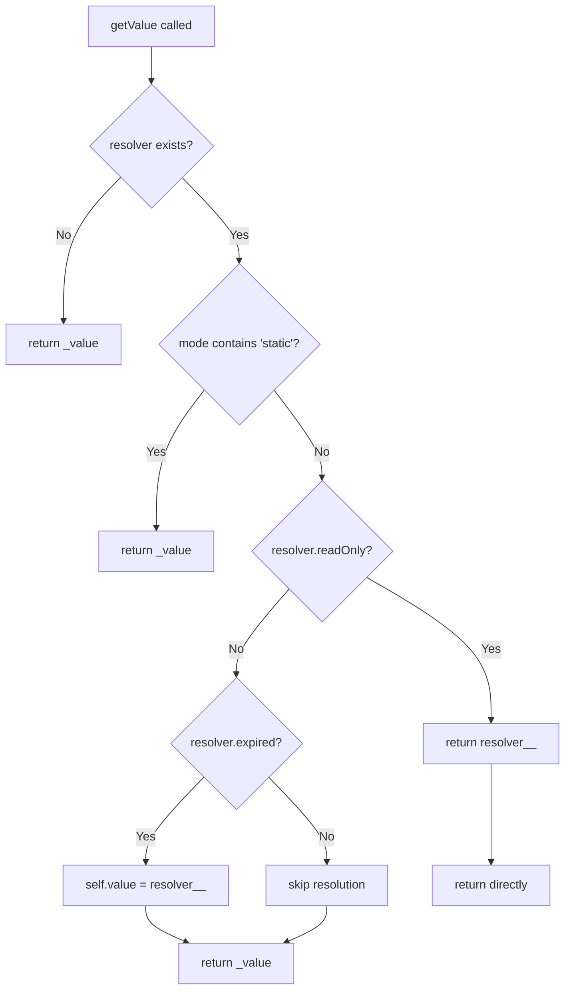
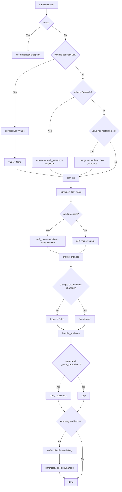
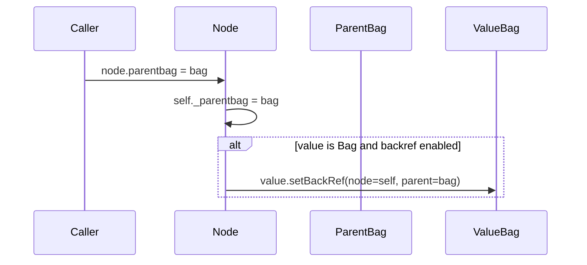
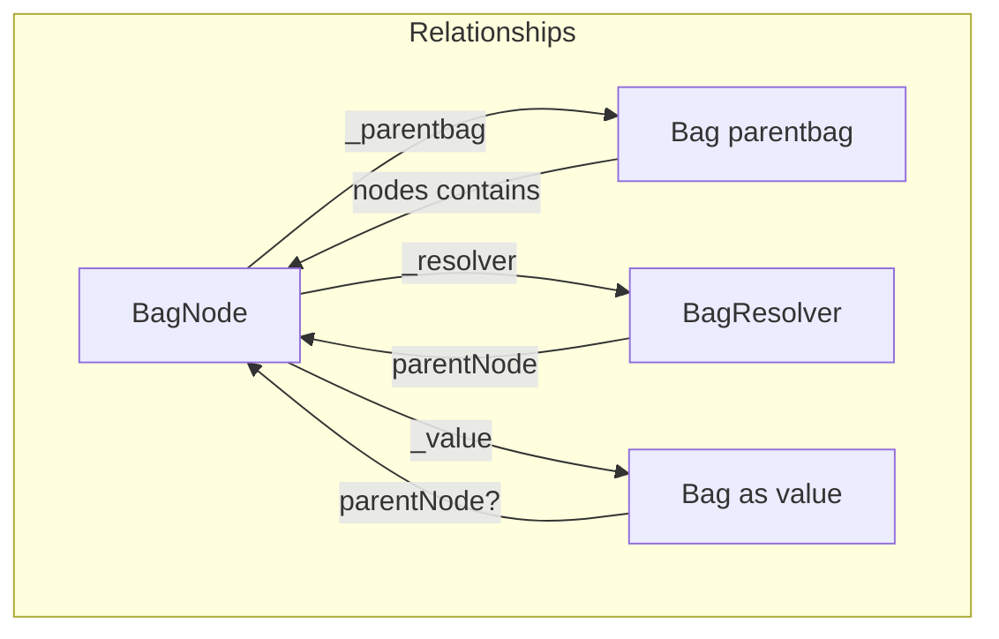

# Original BagNode Specification

## Overview

BagNode is the atomic element that composes a Bag. A Bag is a collection of BagNodes.

Each BagNode contains three main elements:
- **label**: identifying string (key)
- **value**: any value, even another BagNode or a Bag
- **attr**: dictionary of attributes/metadata



---

## Constructor

### Signature

```python
def __init__(self, parentbag, label, value=None, attr=None, resolver=None,
             validators=None, _removeNullAttributes=True, _attributes=None):
```

### Parameters

| Parameter | Type | Default | Description |
|-----------|------|---------|-------------|
| `parentbag` | `Bag` | required | Bag containing this node |
| `label` | `str` | required | Key/name of the node |
| `value` | `Any` | `None` | Node value |
| `attr` | `dict` | `None` | Attributes to set |
| `resolver` | `BagResolver` | `None` | Resolver for lazy loading |
| `validators` | `dict` | `None` | Validators to apply |
| `_removeNullAttributes` | `bool` | `True` | Remove attributes with None value |
| `_attributes` | `dict` | `None` | Fast-path: direct attributes without processing |

### Initialization Flow



### Fast Path (`_attributes`)

When `_attributes` is provided, the constructor skips all processing:
- Does not call `setAttr()`
- Does not call `setValue()`
- Does not apply validators
- Directly assigns `attr` and `_value`

This is an **optimization path** for deserialization or fast copy.

---

## Properties

### value (property)

**Getter**: `getValue(mode='')`
**Setter**: `setValue(value, trigger=True, ...)`

The most important property of the node. Manages lazy loading via resolver.

### staticvalue (property)

**Getter**: `getStaticValue()` → `getValue('static')`
**Setter**: `setStaticValue(value)` → `self._value = value`

Direct access to `_value` bypassing the resolver.

### resolver (property)

**Getter**: `_get_resolver()` → `self._resolver`
**Setter**: `_set_resolver(resolver)`

When setting a resolver, `resolver.parentNode = self` is set.

### parentbag (property)

**Getter**: `_get_parentbag()` → `self._parentbag`
**Setter**: `_set_parentbag(parentbag)`

Reference to the container Bag. Also manages backref on value if it's a Bag.

### fullpath (property)

Read-only. Returns the full path from root, e.g., `"root.child.grandchild"`.

```python
@property
def fullpath(self):
    if not self.parentbag is None:
        fullpath = self.parentbag.fullpath
        if not fullpath is None:
            return '%s.%s' % (fullpath, self.label)
```

### position (property)

Read-only. Returns the node's index in the `parentbag.nodes` list.

```python
@property
def position(self):
    if self.parentbag is not None:
        return [id(n) for n in self.parentbag.nodes].index(id(self))
```

**Note**: Uses `id()` for identity comparison, not equality.

### tag (property)

Read-only. Returns `attr['tag']` if it exists, otherwise `label`.

```python
@property
def tag(self):
    return self.attr.get('tag') or self.label
```

### parentNode (property)

Read-only. Returns the parent node of parentbag (goes up one level).

```python
@property
def parentNode(self):
    if self.parentbag:
        return self.parentbag.parentNode
```

---

## getValue() - Detailed Analysis

```python
def getValue(self, mode=''):
    if not self._resolver == None:
        if 'static' in mode:
            return self._value
        else:
            if self._resolver.readOnly:
                return self._resolver()
            if self._resolver.expired:
                self.value = self._resolver()
            return self._value
    return self._value
```

### Flow Diagram



### Use Cases

#### Case 1: Node without resolver
```python
node._resolver = None
node._value = "hello"
node.getValue()  # → "hello"
```

#### Case 2: Resolver with readOnly=True
```python
node._resolver = MyResolver(readOnly=True)
node.getValue()
# → calls resolver() every time
# → _value is NOT updated
# → value returned directly from resolver
```

#### Case 3: Resolver with readOnly=False, expired=True
```python
node._resolver = MyResolver(readOnly=False, expired=True)
node.getValue()
# → calls resolver()
# → self.value = resolver() (triggers setValue!)
# → return _value (now updated)
```

#### Case 4: Resolver with readOnly=False, expired=False
```python
node._resolver = MyResolver(readOnly=False, expired=False)
node.getValue()
# → does NOT call resolver()
# → return _value (previous cached value)
```

#### Case 5: mode='static'
```python
node._resolver = MyResolver(...)
node.getValue('static')
# → completely ignores the resolver
# → return _value (whatever it is)
```

### Critical Observations

1. **readOnly=True**: the resolver is called EVERY time (subject to resolver's internal cache), the value is NEVER saved in `_value`

2. **readOnly=False + expired**: uses `self.value = resolver()` which triggers `setValue()` with all its side effects (triggers, validators, etc.)

3. **readOnly=False + not expired**: returns `_value` without calling the resolver - relies on the cache in the node itself

4. **Cache is duplicated**:
   - The resolver has its own internal cache (`_cache`, `_cacheLastUpdate`)
   - The node has `_value` which acts as cache when `readOnly=False`

---

## setValue() - Detailed Analysis

```python
def setValue(self, value, trigger=True, _attributes=None, _updattr=None,
             _removeNullAttributes=True, _reason=None):
```

### Parameters

| Parameter | Type | Default | Description |
|-----------|------|---------|-------------|
| `value` | `Any` | required | New value |
| `trigger` | `bool` | `True` | Activate events/triggers |
| `_attributes` | `dict` | `None` | Attributes to set along with the value |
| `_updattr` | `bool` | `None` | Attribute update mode |
| `_removeNullAttributes` | `bool` | `True` | Remove None attrs |
| `_reason` | `Any` | `None` | Reason for change (for events) |

### Flow Diagram



### Special Type Handling

#### BagResolver as value
```python
if isinstance(value, BagResolver):
    self.resolver = value  # sets the resolver
    value = None           # _value becomes None
```
When assigning a resolver as value, it's intercepted and saved in `_resolver`, not in `_value`.

#### BagNode as value
```python
if isinstance(value, BagNode):
    _attributes = _attributes or {}
    _attributes.update(value.attr)  # copy attributes
    value = value._value            # extract internal value
```
When assigning a BagNode, extracts its attributes and value.

#### Object with rootattributes
```python
if hasattr(value, 'rootattributes'):
    rootattributes = value.rootattributes
    if rootattributes:
        _attributes = dict(_attributes or {})
        _attributes.update(rootattributes)
```
If the value has `rootattributes` (e.g., a Bag), merges them into attributes.

### Triggers and Notifications

Trigger occurs only if:
1. `trigger=True` (parameter)
2. The value actually changed (`oldvalue != self._value`)
3. Or attributes changed

Notifications:
1. **Node subscribers**: `subscriber(node=self, info=oldvalue, evt='upd_value')`
2. **Parent bag** (if `backref=True`): `parentbag._onNodeChanged(self, [self.label], oldvalue=oldvalue, evt=evt)`

---

## resolver Property - Detailed Analysis

### Setter

```python
def _set_resolver(self, resolver):
    if not resolver is None:
        resolver.parentNode = self  # bidirectional!
    self._resolver = resolver
```

When assigning a resolver:
1. The resolver receives a reference to the node (`parentNode`)
2. The reference is bidirectional: node → resolver, resolver → node

### Getter

```python
def _get_resolver(self):
    return self._resolver
```

Simple return of the resolver.

### resetResolver()

```python
def resetResolver(self):
    self._resolver.reset()  # invalidate resolver cache
    self.setValue(None)     # set _value to None with trigger
```

Resets both the resolver cache and the node value.

---

## parentbag Property - Detailed Analysis

### Setter

```python
def _set_parentbag(self, parentbag):
    self._parentbag = None
    if parentbag != None:
        if parentbag.backref or True:  # NOTE: "or True" makes backref always True!
            self._parentbag = parentbag
            if hasattr(self._value, '_htraverse') and parentbag.backref:
                self._value.setBackRef(node=self, parent=parentbag)
```

### Observations

1. **Bug/Legacy**: `if parentbag.backref or True` → condition is always True
2. **Weakref commented out**: `#self._parentbag=weakref.ref(parentbag)` - was planned but disabled
3. **Backref on value**: if `_value` is a Bag (has `_htraverse`), sets the backref

### Backref Handling



---

## Attributes Methods

### getAttr()

```python
def getAttr(self, label=None, default=None):
    if not label or label == '#':
        return self.attr  # returns entire dict
    return self.attr.get(label, default)
```

- `node.getAttr()` → entire dict
- `node.getAttr('#')` → entire dict
- `node.getAttr('name')` → single attribute
- `node.getAttr('name', 'default')` → with default

### setAttr()

```python
def setAttr(self, attr=None, trigger=True, _updattr=True,
            _removeNullAttributes=True, **kwargs):
```

| Parameter | Description |
|-----------|-------------|
| `attr` | Dict of attributes |
| `trigger` | Activate notifications |
| `_updattr` | If False, clears attr before setting |
| `_removeNullAttributes` | Remove attributes with None value |
| `**kwargs` | Attributes as keyword arguments |

Flow:
1. If `_updattr=False` → `self.attr.clear()`
2. Merge `attr` dict
3. Merge `**kwargs`
4. Remove None if requested
5. Notify subscribers and parentbag

### delAttr()

```python
def delAttr(self, *attrToDelete):
    if isinstance(attrToDelete, str):
        attrToDelete = attrToDelete.split(',')
    for attr in attrToDelete:
        if attr in list(self.attr.keys()):
            self.attr.pop(attr)
```

Accepts:
- Single string: `node.delAttr('name')`
- Comma-separated string: `node.delAttr('name,age,email')`
- Multiple args: `node.delAttr('name', 'age', 'email')`

### hasAttr()

```python
def hasAttr(self, label=None, value=None):
    if not label in self.attr:
        return False
    if value:
        return (self.attr[label] == value)
    return True
```

- `node.hasAttr('name')` → True if exists
- `node.hasAttr('name', 'John')` → True if exists AND has that value

### getInheritedAttributes()

```python
def getInheritedAttributes(self):
    inherited = {}
    if self.parentbag:
        if self.parentbag.parentNode:
            inherited = self.parentbag.parentNode.getInheritedAttributes()
    inherited.update(self.attr)
    return inherited
```

Walks up the tree and accumulates all attributes from ancestor nodes.

### attributeOwnerNode()

```python
def attributeOwnerNode(self, attrname, **kwargs):
    curr = self
    if not 'attrvalue' in kwargs:
        # search node that HAS the attribute
        while curr and not (attrname in curr.attr):
            curr = curr.parentNode
    else:
        # search node that has attribute with THAT value
        attrvalue = kwargs['attrvalue']
        while curr and curr.attr.get(attrname) != attrvalue:
            curr = curr.parentNode
    return curr
```

Walks up the tree searching for the node that owns a certain attribute.

---

## Validators

### setValidators()

```python
def setValidators(self, validators):
    for k, v in list(validators.items()):
        self.addValidator(k, v)
```

Iterates over dict and calls `addValidator` for each pair.

### addValidator()

```python
def addValidator(self, validator, parameterString):
    if self._validators is None:
        self._validators = BagValidationList(self)
    self._validators.add(validator, parameterString)
```

Lazy initialization of `BagValidationList`.

### removeValidator()

```python
def removeValidator(self, validator):
    if not self._validators is None:
        self._validators.remove(validator)
```

### getValidatorData()

```python
def getValidatorData(self, validator, label=None, dflt=None):
    if not self._validators is None:
        return self._validators.getdata(validator, label=label, dflt=dflt)
```

---

## Subscriptions

### subscribe()

```python
def subscribe(self, subscriberId, callback):
    self._node_subscribers[subscriberId] = callback
```

Registers a callback for node events.

### unsubscribe()

```python
def unsubscribe(self, subscriberId):
    self._node_subscribers.pop(subscriberId)
```

Removes a subscriber.

### Callback Signature

```python
def callback(node, info, evt):
    """
    node: the BagNode that generated the event
    info: depends on event (oldvalue for 'upd_value', attr list for 'upd_attrs')
    evt: event type ('upd_value', 'upd_attrs', 'upd_value_attr')
    """
```

---

## Equality

```python
def __eq__(self, other):
    try:
        if isinstance(other, self.__class__) and (self.attr == other.attr):
            if self._resolver == None:
                return self._value == other._value
            else:
                return self._resolver == other._resolver
        else:
            return False
    except:
        return False

def __ne__(self, other):
    return not self.__eq__(other)
```

Two nodes are equal if:
1. Same class
2. Same attributes
3. If no resolver: same `_value`
4. If resolver: same `_resolver`

**Note**: Does NOT compare the label!

---

## Utility Methods

### asTuple()

```python
def asTuple(self):
    return (self.label, self.value, self.attr, self.resolver)
```

### diff()

```python
def diff(self, other):
    if self.label != other.label:
        return 'Other label: %s' % other.label
    if self.attr != other.attr:
        return 'attributes self:%s --- other:%s' % (self.attr, other.attr)
    if self._value != other._value:
        if isinstance(self._value, Bag):
            return 'value:%s' % self._value.diff(other._value)
        else:
            return 'value self:%s --- other:%s' % (self._value, other._value)
```

Compares two nodes and returns description of the difference.

### toJson()

```python
def toJson(self, typed=True):
    value = self.value
    if isinstance(value, Bag):
        value = value.toJson(typed=typed, nested=True)
    return {"label": self.label, "value": value, "attr": self.attr}
```

### getFormattedValue()

```python
def getFormattedValue(self, joiner=None, omitEmpty=True, mode='', **kwargs):
    v = self.getValue(mode=mode)
    if isinstance(v, Bag):
        v = v.getFormattedValue(joiner=joiner, omitEmpty=omitEmpty, mode=mode, **kwargs)
    else:
        v = self.attr.get('_formattedValue') or self.attr.get('_displayedValue') or v
    if v or not omitEmpty:
        return '%s: %s' % ((self.attr.get('_valuelabel') or
                           self.attr.get('name_long') or
                           self.label.capitalize()), v)
    return ''
```

### __str__ / __repr__

```python
def __str__(self):
    return 'BagNode : %s' % self.label

def __repr__(self):
    return 'BagNode : %s at %i' % (self.label, id(self))
```

---

## Bidirectional Relationships



### Reference Cycles

1. **Node ↔ ParentBag**: `node._parentbag` ↔ `bag.nodes[i]`
2. **Node ↔ Resolver**: `node._resolver` ↔ `resolver.parentNode`
3. **Node ↔ ValueBag**: `node._value` ↔ `value.parentNode` (via backref)

**Note**: Weakref was planned but commented out. Potential memory leaks.

---

## Summary Table

| Aspect | Detail |
|--------|--------|
| **Identifier** | `label` (string) |
| **Value** | `_value` (Any) |
| **Metadata** | `attr` (dict) |
| **Lazy Loading** | via `_resolver` |
| **Container** | `_parentbag` |
| **Events** | `_node_subscribers` |
| **Validation** | `_validators` |
| **Locking** | `locked` (bool) |
| **Entry Point Value** | `getValue(mode)` / `setValue(value, ...)` |
| **Bypass Resolver** | `staticvalue` property or `mode='static'` |
