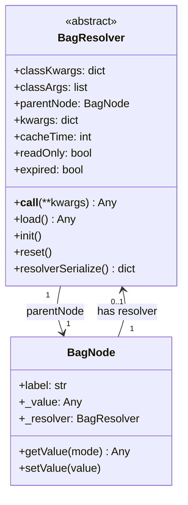
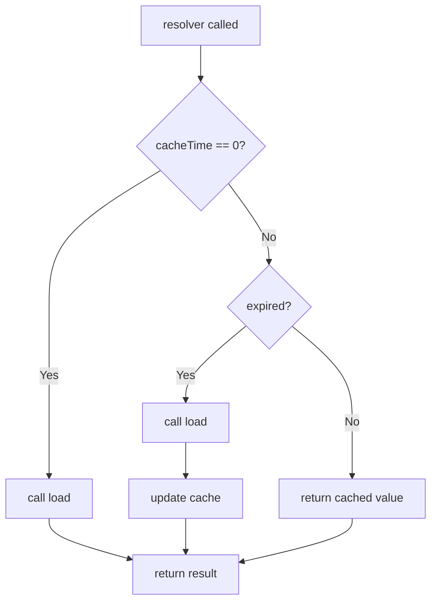
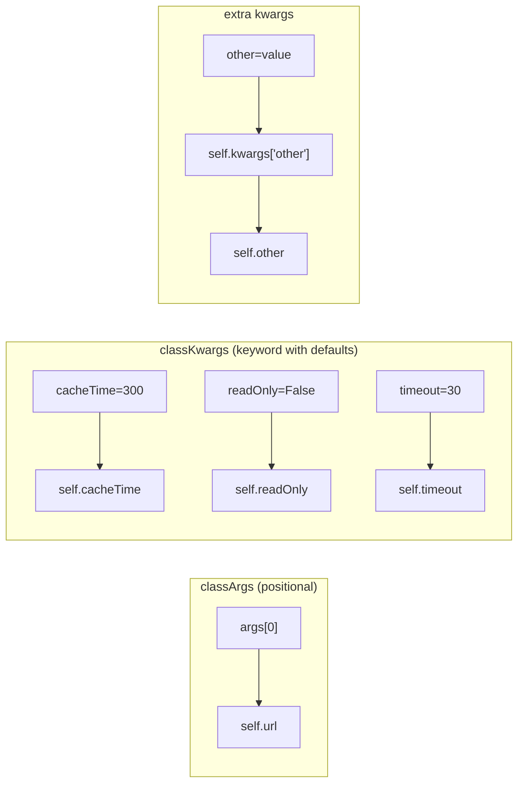
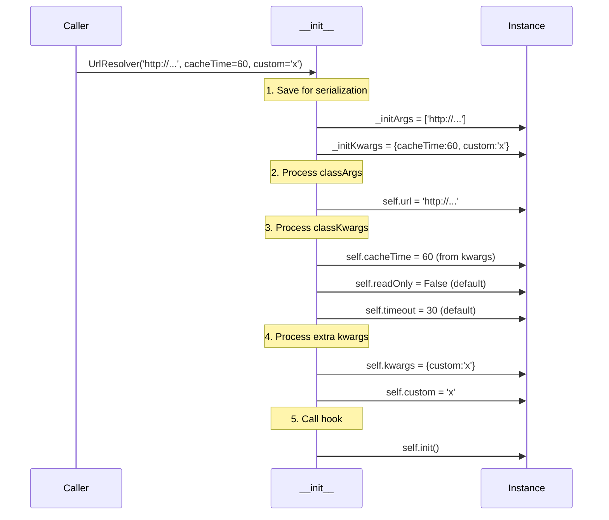
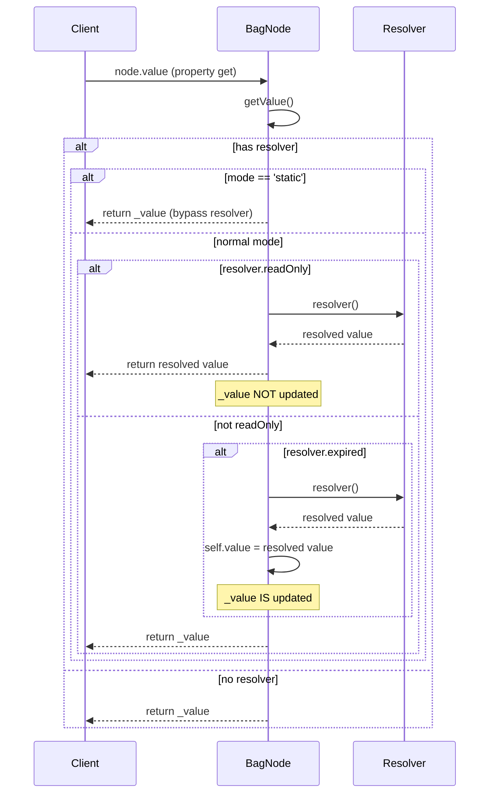
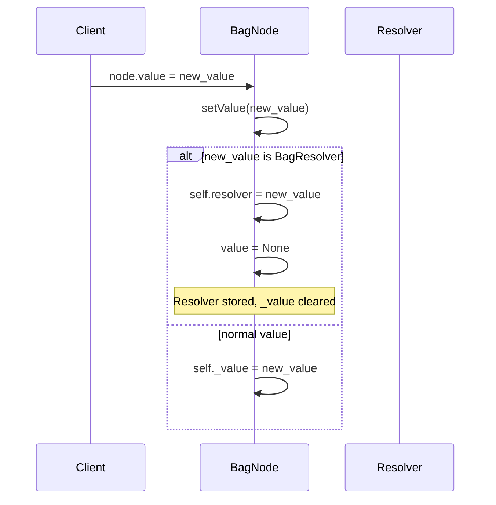
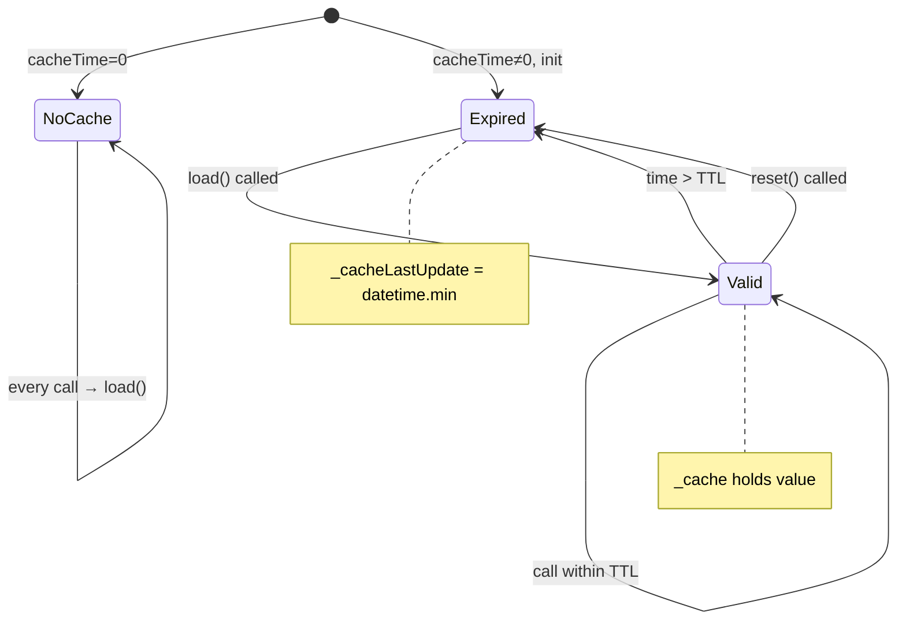
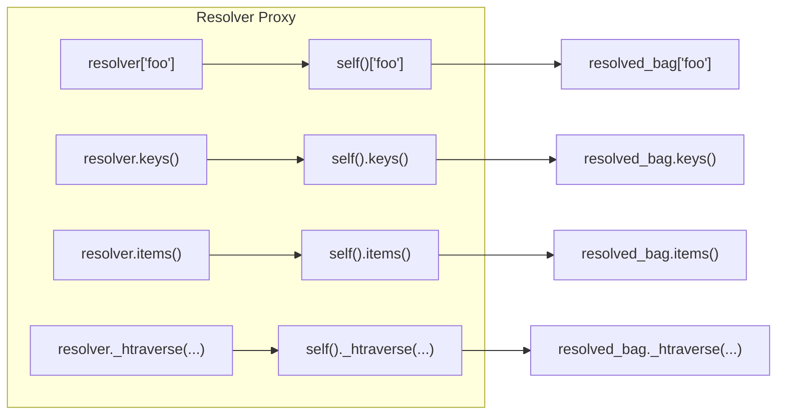
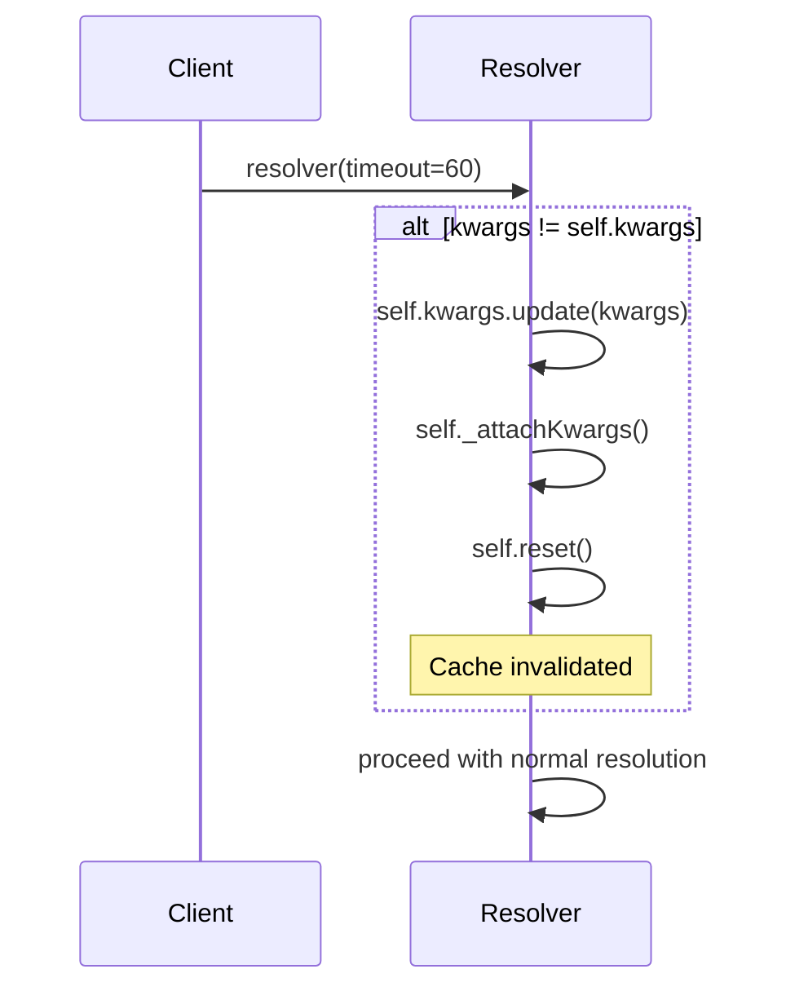

# Original BagResolver Specification

## Overview

BagResolver is an abstract class for **lazy loading** values in BagNodes. Instead of storing a static value, a node can have a resolver that computes the value on-demand.



## Key Concepts

### 1. Callable Pattern

The resolver is **callable**. To get the resolved value:

```python
value = resolver()  # calls __call__
```

This is the **only entry point** to get the resolved value. All other methods (like `keys()`, `items()`) internally call `self()`.

### 2. Caching Semantics



**cacheTime values:**

| Value | Behavior |
|-------|----------|
| `0` | NO cache - `load()` called every time |
| `> 0` | Cache for N seconds (TTL) |
| `< 0` | INFINITE cache (until manual `reset()`) |

### 3. readOnly Flag

When `readOnly=True` (default):
- The resolved value is **NOT** stored in `node._value`
- Each access triggers the resolver (subject to caching)
- The node remains "virtual"

When `readOnly=False`:
- The resolved value **IS** stored in `node._value`
- After first resolution, node behaves like a normal node
- Resolver can be "consumed"

## Class-Level Configuration

Subclasses declare their parameters using class variables:

```python
class UrlResolver(BagResolver):
    classKwargs = {'cacheTime': 300, 'readOnly': False, 'timeout': 30}
    classArgs = ['url']  # positional args

    def load(self):
        return fetch(self.url, timeout=self.timeout)
```



### Parameter Resolution in `__init__`



## Integration with BagNode

### getValue() Flow



### setValue() Flow



## Cache Internals

### State Variables

```python
self._cacheTime        # int: 0, >0, or <0
self._cacheTimeDelta   # timedelta: max duration
self._cache            # Any: cached value
self._cacheLastUpdate  # datetime: when last updated
```

### Cache State Machine



### expired Property Logic

```python
def expired(self):
    if self._cacheTime == 0:          # no cache mode
        return True
    if self._cacheLastUpdate == datetime.min:  # never updated or reset
        return True
    return (datetime.now() - self._cacheLastUpdate) > self._cacheTimeDelta
```

## Proxy Methods

The resolver acts as a **transparent proxy** to the resolved Bag:



**Important:** `_htraverse` on the resolver does NOT implement traversal logic. It simply:
1. Calls `self()` to resolve the value (get the Bag)
2. Delegates `_htraverse` to the resolved Bag

The actual traversal logic lives in the Bag class.

## Serialization

```python
resolver.resolverSerialize()
# Returns:
{
    'resolverclass': 'UrlResolver',
    'resolvermodule': 'myapp.resolvers',
    'args': ['http://example.com'],
    'kwargs': {'cacheTime': 60, 'custom': 'x'}
}
```

**Note:** The base class has `resolverSerialize()` but NO `deserialize()`. Deserialization is handled elsewhere in Genropy.

## Hooks for Subclasses

### load() - REQUIRED

```python
def load(self):
    """Must be overridden. Returns the resolved value."""
    pass  # Base implementation does nothing
```

### init() - OPTIONAL

```python
def init(self):
    """Called at end of __init__. Override for custom setup."""
    pass
```

This hook allows subclasses to do additional initialization without needing to call `super().__init__()`.

## Dynamic kwargs Update

The `__call__` method accepts kwargs that can update resolver parameters at runtime:



This allows changing resolver behavior without creating a new instance.

## Summary

| Aspect | Description |
|--------|-------------|
| **Entry Point** | `resolver()` via `__call__` |
| **Caching** | 0=none, >0=TTL, <0=infinite |
| **readOnly** | True=never store, False=store after resolve |
| **Hooks** | `load()` (required), `init()` (optional) |
| **Proxy** | Transparent delegation to resolved Bag |
| **Serialization** | `resolverSerialize()` only |
