# TreeStore Resolver Specification

## Overview

TreeStoreResolver is an abstract class for **lazy loading** values in TreeStoreNodes. Instead of storing a static value, a node can have a resolver that computes the value on-demand.

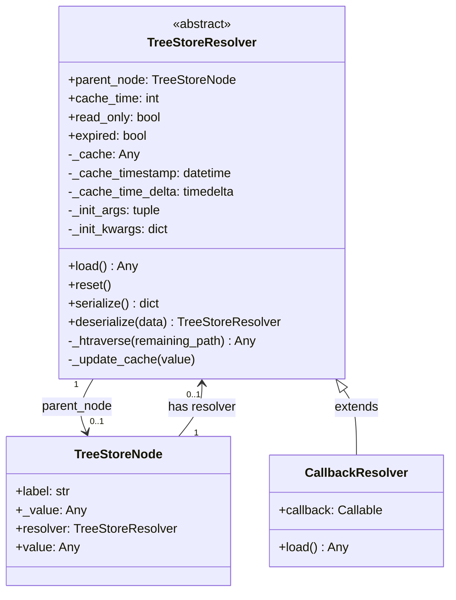

## Key Differences from BagResolver

| Aspect | BagResolver (Original) | TreeStoreResolver |
|--------|------------------------|-------------------|
| **Entry Point** | `resolver()` via `__call__` | `resolver._htraverse()` |
| **Parameter System** | `classArgs` + `classKwargs` class variables | Standard `__init__` kwargs |
| **Async Support** | None | `@smartasync` decorator on `load()` |
| **Serialization** | `resolverSerialize()` only | `serialize()` + `deserialize()` |
| **Proxy Methods** | `keys()`, `items()`, `__getitem__` | None (not a proxy) |
| **Hook Methods** | `init()` hook | None (use `__init__`) |
| **Slots** | No | Yes (`__slots__` for memory efficiency) |

## Key Concepts

### 1. Two Resolver Types

TreeStoreResolver distinguishes between two use cases:

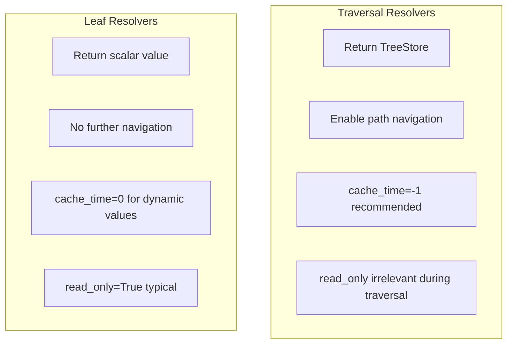

**Traversal Resolvers:**
- Return a `TreeStore` containing hierarchical data
- Enable continued path navigation through resolved content
- Value always stored in `node._value` during path traversal
- Typically use `cache_time=-1` with manual `reset()`

**Leaf Resolvers:**
- Return a scalar value (temperature, computed result, etc.)
- No further path navigation needed
- With `read_only=True`, value is never stored in node
- Typically use `cache_time=0` for always-fresh values

### 2. Caching Semantics

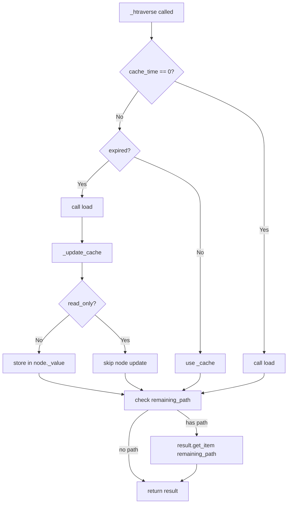

**cache_time values:**

| Value | Behavior |
|-------|----------|
| `0` | NO cache - `load()` called every time (default) |
| `> 0` | Cache for N seconds (TTL) |
| `-1` | INFINITE cache (until manual `reset()`) |

### 3. read_only Flag

When `read_only=True` (default):
- The resolved value is **NOT** stored in `node._value`
- Each access triggers the resolver (subject to internal caching)
- The node remains "virtual" - always delegating to resolver

When `read_only=False`:
- The resolved value **IS** stored in `node._value`
- After first resolution, `_value` holds the result
- Resolver effectively "consumed" (though still present)

**Important:** During path traversal (via `TreeStore._htraverse`), `read_only` is **ignored**. The resolved value is always stored in `node._value` to enable continued navigation.

### 4. Sync/Async Transparency

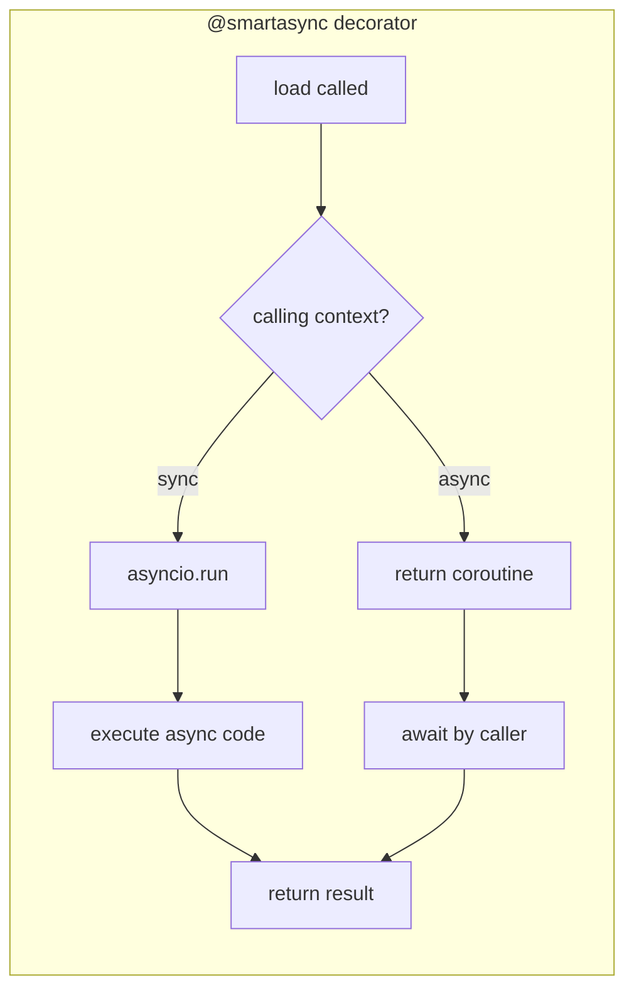

The `@smartasync` decorator on `load()` provides automatic context detection:

```python
# Sync context - works automatically
value = resolver.load()

# Async context - works automatically
value = await resolver.load()
```

This means the same resolver implementation works in both sync and async code without modification.

## Initialization

### `__init__` Parameters

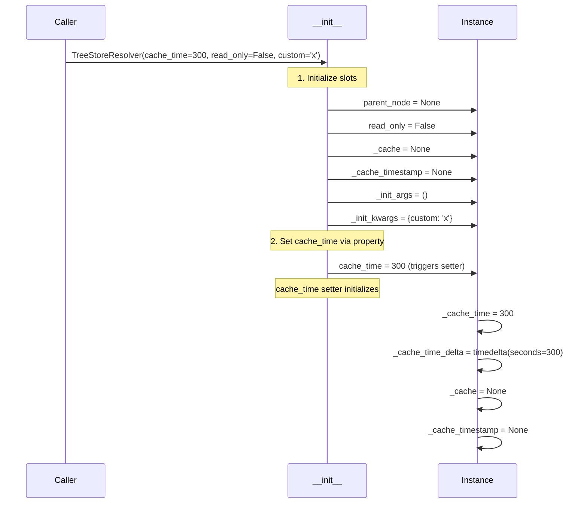

### Subclass Pattern

Subclasses should:
1. Call `super().__init__()` with desired defaults
2. Store custom parameters as instance attributes
3. Set `_init_args` for serialization

```python
class DirectoryResolver(TreeStoreResolver):
    def __init__(self, path: str, **kwargs):
        super().__init__(cache_time=-1, **kwargs)  # infinite cache by default
        self.path = path
        self._init_args = (path,)  # for serialization

    @smartasync
    async def load(self):
        # ... load directory contents ...
        return TreeStore(...)
```

## Cache Internals

### State Variables

```python
self._cache_time       # int: 0, >0, or -1
self._cache_time_delta # timedelta: max duration (None if cache_time=0)
self._cache            # Any: cached value
self._cache_timestamp  # datetime: when last updated (None if never)
```

### Cache State Machine

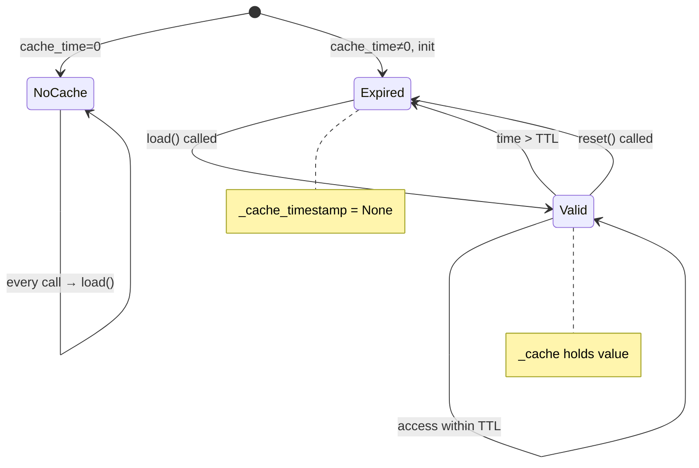

### expired Property Logic

```python
@property
def expired(self) -> bool:
    if self._cache_time == 0:           # no cache mode
        return True
    if self._cache_timestamp is None:   # never updated or reset
        return True
    elapsed = datetime.now() - self._cache_timestamp
    return elapsed > self._cache_time_delta
```

### cache_time Property Setter

```python
@cache_time.setter
def cache_time(self, value: int) -> None:
    self._cache_time = value
    if value != 0:
        if value < 0:
            self._cache_time_delta = timedelta.max  # infinite
        else:
            self._cache_time_delta = timedelta(seconds=value)
        self._cache = None
        self._cache_timestamp = None
    # Note: if value == 0, delta/cache/timestamp are NOT reset
```

## The _htraverse Method

This is the **main entry point** for value resolution, called when accessing `node.value` on a node with a resolver.

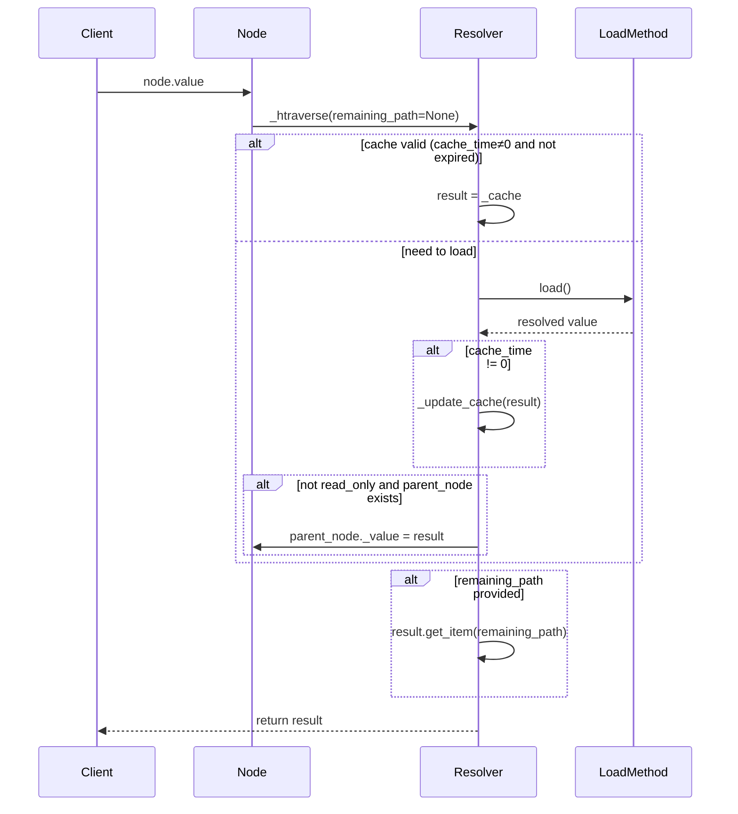

### remaining_path Parameter

The `remaining_path` parameter enables continued traversal after resolution:

```python
# When accessing store['alfa.beta.gamma'] where 'beta' has resolver:
# 1. Traversal reaches 'beta'
# 2. Calls resolver._htraverse('gamma')
# 3. Resolver loads, gets TreeStore
# 4. Continues with result.get_item('gamma')
```

**Note:** This differs from BagResolver where `_htraverse` was a simple proxy to `self()._htraverse()`. In TreeStoreResolver, `_htraverse` contains the actual resolution logic.

## Integration with TreeStoreNode

### Setting a Resolver

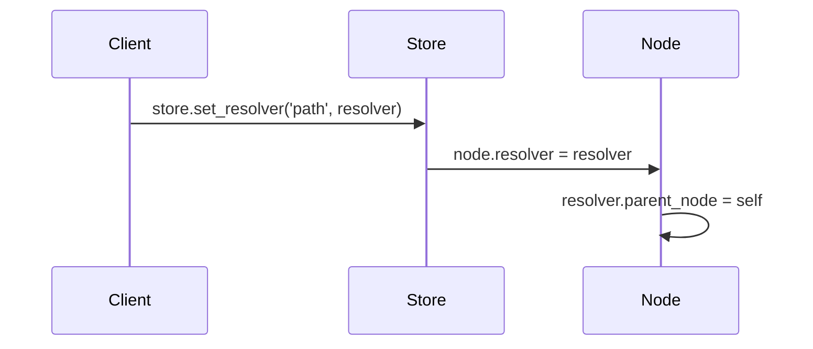

When a resolver is assigned to a node:
1. The resolver's `parent_node` is set to the node
2. This allows the resolver to access node context (label, attributes, parent store)

### Accessing Value

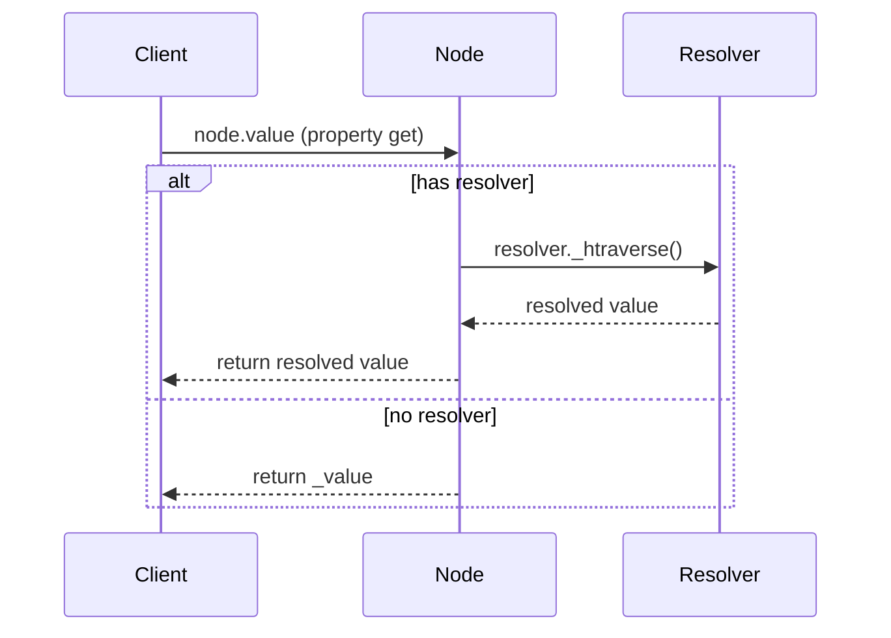

## Serialization

### serialize() Method

```python
resolver.serialize()
# Returns:
{
    'resolver_module': 'myapp.resolvers',
    'resolver_class': 'DirectoryResolver',
    'args': ('/path/to/dir',),
    'kwargs': {
        'cache_time': -1,
        'read_only': True,
        # ... any custom kwargs from _init_kwargs
    }
}
```

### deserialize() Class Method

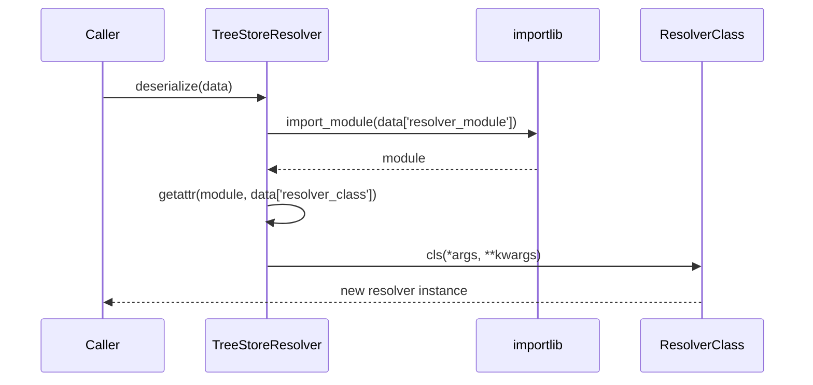

**Important:** Unlike BagResolver (which only had `resolverSerialize()`), TreeStoreResolver provides both `serialize()` and `deserialize()` as a complete round-trip solution.

### Serialization Requirements for Subclasses

Subclasses must:
1. Set `_init_args` to positional arguments needed for reconstruction
2. Pass custom kwargs to `super().__init__(**kwargs)` - they're stored in `_init_kwargs`

```python
class UrlResolver(TreeStoreResolver):
    def __init__(self, url: str, timeout: int = 30, **kwargs):
        super().__init__(**kwargs)
        self.url = url
        self.timeout = timeout
        self._init_args = (url,)
        self._init_kwargs['timeout'] = timeout  # add custom param
```

## CallbackResolver

A concrete resolver that delegates to a callback function.

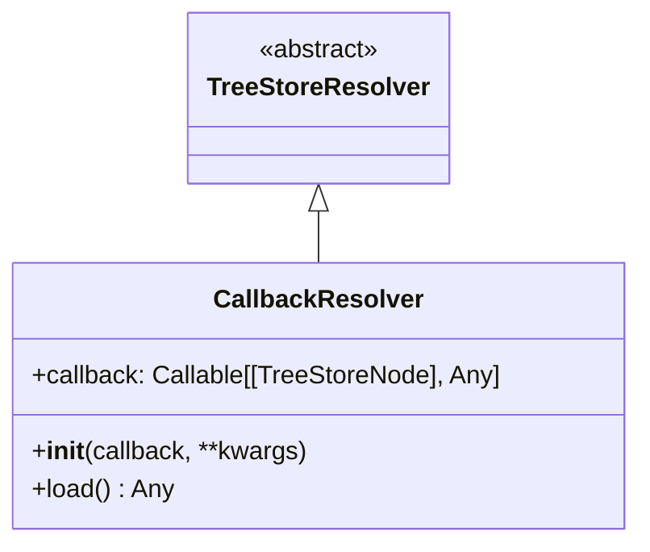

### Callback Signature

```python
def my_callback(node: TreeStoreNode) -> Any:
    """
    Args:
        node: The TreeStoreNode this resolver is attached to.
              Access node.label, node.attr, node.parent (TreeStore)

    Returns:
        The computed value
    """
    pass
```

### Example Usage

```python
def compute_total(node):
    store = node.parent
    price = store.get_item('price')
    quantity = store.get_item('quantity')
    return price * quantity

store.set_item('price', 100)
store.set_item('quantity', 5)
store.set_item('total')
store.set_resolver('total', CallbackResolver(compute_total))

print(store['total'])  # 500
```

### Serialization Constraint

For CallbackResolver serialization to work, the callback must be a **top-level importable function**:

```python
# OK - top-level function
def my_callback(node):
    return node.label.upper()

resolver = CallbackResolver(my_callback)
data = resolver.serialize()  # Works
restored = TreeStoreResolver.deserialize(data)  # Works

# NOT OK - lambda
resolver = CallbackResolver(lambda n: n.label.upper())
data = resolver.serialize()  # Works but...
restored = TreeStoreResolver.deserialize(data)  # Fails!

# NOT OK - nested function
def outer():
    def inner(node):
        return node.label
    return CallbackResolver(inner)  # Cannot serialize
```

## Hooks for Subclasses

### load() - REQUIRED

```python
@smartasync
async def load(self) -> Any:
    """Must be overridden. Returns the resolved value.

    Use @smartasync decorator for sync/async transparency.
    """
    raise NotImplementedError("Subclasses must implement load()")
```

**Note:** Unlike BagResolver which had an `init()` hook, TreeStoreResolver uses standard Python `__init__`. Subclasses should call `super().__init__()`.

## Memory Efficiency

TreeStoreResolver uses `__slots__` for memory efficiency:

```python
__slots__ = (
    "parent_node",
    "_cache_time",
    "read_only",
    "_cache",
    "_cache_timestamp",
    "_cache_time_delta",
    "_init_args",
    "_init_kwargs",
)
```

Subclasses should also define `__slots__` for their additional attributes:

```python
class DirectoryResolver(TreeStoreResolver):
    __slots__ = ("path", "include", "exclude")

    def __init__(self, path, include="", exclude="", **kwargs):
        super().__init__(**kwargs)
        self.path = path
        self.include = include
        self.exclude = exclude
```

## NOT a Proxy

Unlike BagResolver, TreeStoreResolver does **NOT** act as a transparent proxy:

```python
# BagResolver (original) - HAD proxy methods:
resolver['foo']      # delegated to self()['foo']
resolver.keys()      # delegated to self().keys()
resolver.items()     # delegated to self().items()

# TreeStoreResolver - NO proxy methods:
resolver['foo']      # AttributeError!
resolver.keys()      # AttributeError!
```

This is intentional. TreeStoreResolver is a pure value-resolution mechanism, not a proxy object. Access resolved content through the node or store:

```python
# Correct usage:
node.value['foo']           # access via node
store['path.to.node.foo']   # access via store path
```

## Summary

| Aspect | Description |
|--------|-------------|
| **Entry Point** | `_htraverse(remaining_path)` |
| **Caching** | 0=none (default), >0=TTL seconds, -1=infinite |
| **read_only** | True=never store in node, False=store after resolve |
| **Async** | `@smartasync` on `load()` for sync/async transparency |
| **Hooks** | `load()` required, no `init()` hook |
| **Serialization** | `serialize()` + `deserialize()` (round-trip) |
| **Proxy** | NO - not a transparent proxy |
| **Memory** | Uses `__slots__` |

## Comparison Summary: BagResolver vs TreeStoreResolver

```mermaid
flowchart TB
    subgraph BagResolver
        B1[__call__ entry point]
        B2[classArgs/classKwargs]
        B3[init hook]
        B4[Proxy methods]
        B5[No async]
        B6[resolverSerialize only]
    end

    subgraph TreeStoreResolver
        T1[_htraverse entry point]
        T2[Standard __init__ kwargs]
        T3[No init hook]
        T4[No proxy methods]
        T5[@smartasync on load]
        T6[serialize + deserialize]
    end

    B1 -.->|simplified to| T1
    B2 -.->|simplified to| T2
    B3 -.->|removed| T3
    B4 -.->|removed| T4
    B5 -.->|added| T5
    B6 -.->|enhanced| T6
```
