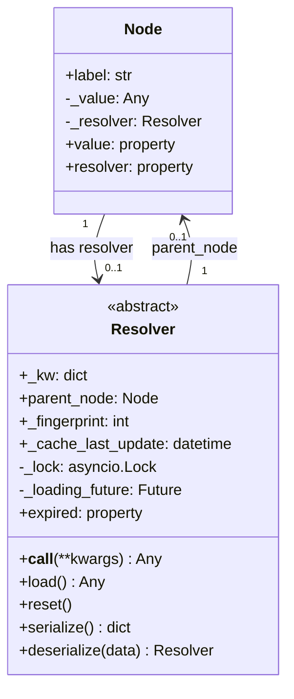

# Resolver Specification

**Status**: 🟢 APPROVED
**Version**: 1.0.0
**Last Updated**: 2025-01-02
**Decisions Document**: [03-resolver_comparison_decisions.md](03-resolver_comparison_decisions.md)

---

## Table of Contents

1. [Overview](#overview)
2. [Architecture](#architecture)
3. [Class Design](#class-design)
4. [Parameter System](#parameter-system)
5. [Cache Architecture](#cache-architecture)
6. [Async Support](#async-support)
7. [Serialization](#serialization)
8. [Proxy Behavior](#proxy-behavior)
9. [Node-Resolver Interaction](#node-resolver-interaction)
10. [Subclassing Guide](#subclassing-guide)
11. [Implementation Plan](#implementation-plan)
12. [Test Plan](#test-plan)

---

## 1. Overview

A Resolver enables lazy/dynamic value computation for a Node. Instead of storing a static value, a Node can have a Resolver that computes the value on-demand.

### Key Characteristics

- **Lazy Loading**: Values computed only when accessed
- **Two Modes**: `read_only=True` (pure getter) vs `read_only=False` (cached)
- **TTL Support**: Configurable cache expiration via `cache_time`
- **Async Ready**: Uses `@smartasync` for sync/async unified API
- **Memory Efficient**: Uses `__slots__` with `_kw` dict for parameters

### Relationship Diagram



---

## 2. Architecture

### Design Decisions Summary

| # | Aspect | Decision | Type |
|---|--------|----------|------|
| 1 | Entry Point | `__call__` | 🅾️ Original |
| 2 | Parameter System | `class_kwargs`/`class_args` | 🅾️ Original |
| 3 | Naming Convention | snake_case (wrapper for JS) | 🆃 TreeStore |
| 4 | Cache Initial State | `None` + `or datetime.min` | 🆕 New |
| 5 | Async Support | `@smartasync` + Lock/Future in Resolver | 🆕 New |
| 6 | Proxy Behavior | Explicit proxy methods | 🅾️ Original |
| 7 | Serialization | `serialize()`/`deserialize()` symmetric | 🆕 New |
| 8 | Subclass Hooks | `init()` hook + `NotImplementedError` | 🆕 New |
| 9 | Equality | Fingerprint at init for `__eq__` | 🆕 New |
| 10 | Parent Node Ref | Direct attribute `parent_node` | 🆕 New |
| 11 | Memory Management | `__slots__` + `_kw` dict | 🆕 New |
| 12 | Dynamic kwargs | Only for `read_only=True`, temp merge | 🆕 New |
| 13 | Default Values | `cache_time=0`, `read_only=True` | 🅾️ Original |
| 14 | instanceKwargs | Removed (use `serialize()` or `_kw`) | 🆕 New |
| 15 | Cache Architecture | Single cache in `node._value` | 🆕 New |

**Legend**: 🅾️ = Original BagResolver, 🆃 = TreeStoreResolver, 🆕 = New design

---

## 3. Class Design

### Complete Class Structure

```python
from __future__ import annotations

import json
import importlib
from datetime import datetime, timedelta
from typing import Any, ClassVar

from genro_toolbox import smartasync


class Resolver:
    """Base class for lazy/dynamic value resolution.

    A Resolver computes values on-demand for a Node. Two modes:
    - read_only=True: Pure getter, always calls load()
    - read_only=False: Cached value with TTL

    Subclasses must implement load() method.

    Example:
        class UrlResolver(Resolver):
            class_kwargs = {'cache_time': 300, 'timeout': 30}
            class_args = ['url']

            @smartasync
            async def load(self):
                return await fetch(self._kw['url'], timeout=self._kw['timeout'])
    """

    # Class-level parameter definitions (override in subclasses)
    class_kwargs: ClassVar[dict[str, Any]] = {'cache_time': 0, 'read_only': True}
    class_args: ClassVar[list[str]] = []

    # Instance storage - memory efficient
    __slots__ = (
        '_kw',                  # dict: all parameters from class_kwargs/class_args
        '_init_args',           # tuple: original positional args (for serialize)
        '_init_kwargs',         # dict: original keyword args (for serialize)
        'parent_node',          # Node | None: bidirectional link to parent
        '_fingerprint',         # int: hash for __eq__ comparison
        '_cache_last_update',   # datetime | None: last load() timestamp
        '_lock',                # asyncio.Lock | None: for concurrent access (on-demand)
        '_loading_future',      # Future | None: shares result during loading
    )

    def __init__(self, *args, **kwargs):
        """Initialize resolver with classArgs/classKwargs system.

        Args:
            *args: Positional args mapped to class_args names
            **kwargs: Keyword args merged with class_kwargs defaults
        """
        # Store original args for serialization
        self._init_args = args
        self._init_kwargs = dict(kwargs)

        # Parent node reference (set by Node when attached)
        self.parent_node = None

        # Cache timestamp (None = never loaded)
        self._cache_last_update = None

        # Concurrency control (created on-demand)
        self._lock = None
        self._loading_future = None

        # Build _kw dict from class_args and class_kwargs
        self._kw = {}

        # Map positional args to class_args names
        for j, arg in enumerate(args):
            if j < len(self.class_args):
                param_name = self.class_args[j]
                self._kw[param_name] = arg
                kwargs.pop(param_name, None)  # Remove if also in kwargs

        # Map kwargs with defaults from class_kwargs
        for param_name, default in self.class_kwargs.items():
            self._kw[param_name] = kwargs.pop(param_name, default)

        # Store any extra kwargs in _kw as well
        self._kw.update(kwargs)

        # Compute fingerprint for equality comparison
        self._fingerprint = self._compute_fingerprint()

        # Call subclass hook
        self.init()

    def init(self):
        """Hook for subclass initialization.

        Override this instead of __init__ to avoid super() complexity.
        Called after all base class setup is complete.
        """
        pass

    # =========================================================================
    # ENTRY POINT
    # =========================================================================

    def __call__(self, **kwargs) -> Any:
        """Resolve and return the value.

        For read_only=True: kwargs are merged temporarily for this call only.
        For read_only=False: kwargs are ignored, uses concurrency control.

        Returns:
            The resolved value from load().
        """
        read_only = self._kw.get('read_only', True)

        if read_only:
            # Pure getter mode: always call load(), no concurrency control
            # Each call is independent
            if kwargs:
                original_kw = self._kw
                self._kw = {**original_kw, **kwargs}
                try:
                    return self.load()
                finally:
                    self._kw = original_kw
            return self.load()

        # Cached mode: use concurrency control
        return self._resolve_cached()

    def _resolve_cached(self) -> Any:
        """Resolve with concurrency control for read_only=False.

        Ensures only one load() runs at a time. Other callers wait
        for the result via Future.

        Returns:
            The resolved value, or None to signal Node to use _value.
        """
        import asyncio

        # Fast path: cache valid
        if not self.expired:
            return None  # Signal Node to use cached _value

        # If Future exists, another call is loading - wait for it
        if self._loading_future is not None:
            # In async context, await the future
            # In sync context, smartasync handles it
            return self._loading_future

        # First caller: create lock and future
        if self._lock is None:
            self._lock = asyncio.Lock()

        return self._do_locked_load()

    async def _do_locked_load(self) -> Any:
        """Execute load() under lock with Future sharing.

        Returns:
            The resolved value.
        """
        import asyncio

        async with self._lock:
            # Double-check after acquiring lock
            if not self.expired:
                return None  # Another caller completed while we waited

            # Create Future for other callers to await
            loop = asyncio.get_event_loop()
            self._loading_future = loop.create_future()

            try:
                result = await self.load()
                self._cache_last_update = datetime.now()
                self._loading_future.set_result(result)
                return result
            except Exception as e:
                self._loading_future.set_exception(e)
                raise
            finally:
                self._loading_future = None

    # =========================================================================
    # ABSTRACT METHOD
    # =========================================================================

    @smartasync
    async def load(self) -> Any:
        """Load and return the resolved value.

        MUST be overridden in subclasses.

        Use @smartasync decorator for sync/async compatibility:
        - Called from sync context: runs with asyncio.run()
        - Called from async context: returns coroutine (await it)

        Returns:
            The resolved value.

        Raises:
            NotImplementedError: If not overridden in subclass.
        """
        raise NotImplementedError("Subclasses must implement load()")

    # =========================================================================
    # CACHE MANAGEMENT
    # =========================================================================

    @property
    def expired(self) -> bool:
        """Check if cached value has expired.

        Returns:
            True if:
            - Never loaded (_cache_last_update is None)
            - cache_time == 0 (no cache)
            - Elapsed time > cache_time seconds

            False if:
            - cache_time < 0 (infinite cache)
            - Within TTL
        """
        cache_time = self._kw.get('cache_time', 0)

        # No cache or never loaded
        if cache_time == 0 or self._cache_last_update is None:
            return True

        # Infinite cache
        if cache_time < 0:
            return False

        # Check TTL
        elapsed = datetime.now() - self._cache_last_update
        return elapsed > timedelta(seconds=cache_time)

    def reset(self):
        """Invalidate cache, forcing reload on next access.

        Sets _cache_last_update to None so expired returns True.
        """
        self._cache_last_update = None

    # =========================================================================
    # EQUALITY
    # =========================================================================

    def _compute_fingerprint(self) -> int:
        """Compute hash based on serializable state.

        Called once at __init__, result stored in _fingerprint.

        Returns:
            Integer hash for equality comparison.
        """
        data = {
            'resolver_class': self.__class__.__name__,
            'resolver_module': self.__class__.__module__,
            'args': self._init_args,
            'kwargs': dict(self._kw),
        }
        return hash(json.dumps(data, sort_keys=True, default=str))

    def __eq__(self, other) -> bool:
        """Compare resolvers by fingerprint.

        Two resolvers are equal if same class and same parameters.
        O(1) comparison using pre-computed fingerprint.
        """
        if not isinstance(other, self.__class__):
            return False
        return self._fingerprint == other._fingerprint

    # =========================================================================
    # SERIALIZATION
    # =========================================================================

    def serialize(self) -> dict[str, Any]:
        """Serialize resolver for persistence/transport.

        Returns:
            Dict with all info to recreate the resolver:
            - resolver_module: Module path
            - resolver_class: Class name
            - args: Original positional arguments
            - kwargs: All parameters including defaults
        """
        return {
            'resolver_module': self.__class__.__module__,
            'resolver_class': self.__class__.__name__,
            'args': list(self._init_args),
            'kwargs': dict(self._kw),
        }

    @classmethod
    def deserialize(cls, data: dict[str, Any]) -> 'Resolver':
        """Recreate resolver from serialized data.

        Args:
            data: Dict from serialize()

        Returns:
            New Resolver instance with same parameters.
        """
        module = importlib.import_module(data['resolver_module'])
        resolver_cls = getattr(module, data['resolver_class'])
        return resolver_cls(*data.get('args', ()), **data.get('kwargs', {}))

    # =========================================================================
    # PROXY METHODS (delegate to resolved value)
    # =========================================================================

    def __getitem__(self, key):
        """Proxy for resolved_value[key]."""
        return self()[key]

    def keys(self):
        """Proxy for resolved_value.keys()."""
        return list(self().keys())

    def items(self):
        """Proxy for resolved_value.items()."""
        return list(self().items())

    def values(self):
        """Proxy for resolved_value.values()."""
        return list(self().values())

    def get_node(self, key):
        """Proxy for resolved_value.get_node(key)."""
        return self().get_node(key)

    def _htraverse(self, *args, **kwargs):
        """Proxy for resolved_value._htraverse()."""
        return self()._htraverse(*args, **kwargs)

    # =========================================================================
    # CONVENIENCE PROPERTIES
    # =========================================================================

    @property
    def read_only(self) -> bool:
        """Whether resolver is in read-only (pure getter) mode."""
        return self._kw.get('read_only', True)

    @property
    def cache_time(self) -> int:
        """Cache TTL in seconds (0=none, >0=seconds, -1=infinite)."""
        return self._kw.get('cache_time', 0)
```

---

## 4. Parameter System

### class_kwargs and class_args

The parameter system allows subclasses to declare their parameters declaratively:

```python
class UrlResolver(Resolver):
    # Parameters with defaults (keyword args)
    class_kwargs = {
        'cache_time': 300,      # Cache for 5 minutes
        'read_only': False,     # Cache the result
        'timeout': 30,          # Custom parameter
        'headers': None,        # Custom parameter
    }

    # Required positional parameters
    class_args = ['url']  # First positional arg becomes _kw['url']
```

### Usage

```python
# All equivalent:
resolver = UrlResolver('https://api.example.com')
resolver = UrlResolver('https://api.example.com', timeout=60)
resolver = UrlResolver(url='https://api.example.com', timeout=60)

# Access parameters:
resolver._kw['url']      # 'https://api.example.com'
resolver._kw['timeout']  # 60 (overridden) or 30 (default)
resolver._kw['cache_time']  # 300 (default)
```

### Parameter Storage

All parameters (from class_args, class_kwargs, and extra kwargs) are stored in `self._kw` dict:

```python
# After: UrlResolver('http://x', timeout=60, custom='value')
self._kw = {
    'url': 'http://x',
    'cache_time': 300,
    'read_only': False,
    'timeout': 60,
    'headers': None,
    'custom': 'value',  # Extra kwargs also stored
}
```

---

## 5. Cache Architecture

### Single Cache Location

**Decision**: Cache lives in `node._value`, NOT in resolver.

```
┌─────────────────────────────────────────────────────┐
│                      Node                           │
│  ┌─────────────┐    ┌─────────────────────────┐    │
│  │   _value    │◄───│  Cache storage          │    │
│  │  (cached)   │    │  (for read_only=False)  │    │
│  └─────────────┘    └─────────────────────────┘    │
│         ▲                                           │
│         │ stores result                             │
│         │                                           │
│  ┌──────┴──────┐                                   │
│  │  _resolver  │───► Resolver instance             │
│  └─────────────┘     (provides load() + TTL info)  │
└─────────────────────────────────────────────────────┘
```

### Two Modes

#### read_only=True (Pure Getter)

```python
node.value  # → resolver.load() called
node.value  # → resolver.load() called again
node.value  # → resolver.load() called again
# Value NEVER stored in node._value
# cache_time IGNORED
```

#### read_only=False (Cached Value)

```python
node.value  # → resolver.load() called, stored in node._value
node.value  # → returns node._value (within TTL)
node.value  # → returns node._value (within TTL)
# After TTL expires:
node.value  # → resolver.load() called, updates node._value
```

### cache_time Values

| Value | Behavior |
|-------|----------|
| `0` | Always expired (reload every time, but stores value) |
| `> 0` | Cache for N seconds |
| `-1` | Cache forever (until manual `reset()`) |

---

## 6. Async Support

### @smartasync Decorator

The `load()` method uses `@smartasync` from `genro-toolbox` for unified sync/async API:

```python
class ApiResolver(Resolver):
    class_args = ['endpoint']

    @smartasync
    async def load(self):
        async with aiohttp.ClientSession() as session:
            async with session.get(self._kw['endpoint']) as response:
                return await response.json()
```

### Usage Patterns

```python
resolver = ApiResolver('https://api.example.com/data')

# Sync context - automatically uses asyncio.run()
data = resolver()

# Async context - returns coroutine
async def main():
    data = await resolver()
```

### Concurrency Control (Lock + Future)

**Key Design Decision**: Lock and Future live in the Resolver, not the Node.

This keeps Node simple while Resolver encapsulates all its complexity:
- Node just calls `resolver()` and gets a value
- Resolver manages loading AND concurrent access

```
┌──────────────────────────────────────────────────────────┐
│                    Resolver                              │
│                                                          │
│  ┌─────────────┐    ┌─────────────────────────────┐     │
│  │   _lock     │    │  Serializes load() calls    │     │
│  │ (on-demand) │    │  Only one loads at a time   │     │
│  └─────────────┘    └─────────────────────────────┘     │
│                                                          │
│  ┌─────────────┐    ┌─────────────────────────────┐     │
│  │  _loading   │    │  Shares result with callers │     │
│  │   _future   │    │  arriving during load()     │     │
│  └─────────────┘    └─────────────────────────────┘     │
└──────────────────────────────────────────────────────────┘
```

### Concurrency Timeline

```
T0: Request 1 → resolver() → expired, future=None → lock, create future, load()
T1: Request 2 → resolver() → expired, future=SET → await future (bypass lock)
T2: Request 3 → resolver() → expired, future=SET → await future (bypass lock)
T3: load() completes → future.set_result() → all receive result
T4: release lock, future=None
```

### When Concurrency Control Applies

| Mode | Lock | Future | Behavior |
|------|------|--------|----------|
| `read_only=True` | No | No | Each call independent |
| `read_only=False` | Yes | Yes | Single load, shared result |

### How @smartasync Works

```
┌──────────────────────────────────────────────────────────┐
│                    @smartasync                           │
│                                                          │
│  Detects context at runtime:                            │
│                                                          │
│  ┌─────────────────┐     ┌─────────────────────────┐   │
│  │  Sync context   │     │    Async context        │   │
│  │  (no event loop)│     │    (event loop exists)  │   │
│  └────────┬────────┘     └───────────┬─────────────┘   │
│           │                          │                  │
│           ▼                          ▼                  │
│  ┌─────────────────┐     ┌─────────────────────────┐   │
│  │ asyncio.run()   │     │ Return coroutine       │   │
│  │ (blocks)        │     │ (caller awaits)         │   │
│  └─────────────────┘     └─────────────────────────┘   │
└──────────────────────────────────────────────────────────┘
```

---

## 7. Serialization

### serialize() / deserialize()

Round-trip serialization for persistence (XML, JSON, database):

```python
# Serialize
resolver = UrlResolver('https://api.example.com', timeout=60)
data = resolver.serialize()
# {
#     'resolver_module': 'myapp.resolvers',
#     'resolver_class': 'UrlResolver',
#     'args': ['https://api.example.com'],
#     'kwargs': {'cache_time': 300, 'read_only': False, 'timeout': 60, ...}
# }

# Deserialize
restored = Resolver.deserialize(data)
assert resolver == restored  # True (same fingerprint)
```

### Integration with Bag XML Serialization

```xml
<node label="api_data">
    <resolver
        module="myapp.resolvers"
        class="UrlResolver"
        args="['https://api.example.com']"
        kwargs="{'timeout': 60}"
    />
</node>
```

---

## 8. Proxy Behavior

### Transparent Access to Resolved Value

The resolver provides proxy methods to access the resolved value directly:

```python
resolver = DirectoryResolver('/path/to/dir')

# These are equivalent:
resolver()['file.txt']      # Explicit call + getitem
resolver['file.txt']        # Proxy __getitem__

resolver().keys()           # Explicit call + keys
resolver.keys()             # Proxy keys()
```

### Available Proxies

| Method | Delegates to |
|--------|--------------|
| `__getitem__(key)` | `self()[key]` |
| `keys()` | `self().keys()` |
| `items()` | `self().items()` |
| `values()` | `self().values()` |
| `get_node(key)` | `self().get_node(key)` |
| `_htraverse(...)` | `self()._htraverse(...)` |

---

## 9. Node-Resolver Interaction

### Design Principle

**Node is simple. Resolver encapsulates complexity.**

The Node doesn't know about locks, futures, or async details. It just calls `resolver()` and receives a value. The Resolver handles everything internally.

### Node.get_value() Implementation

```python
class Node:
    def get_value(self):
        if self._resolver is None:
            return self._value

        if self._resolver.read_only:
            # Pure getter: resolver handles everything
            return self._resolver()

        # Cached mode: resolver manages concurrency
        if self._resolver.expired:
            result = self._resolver()  # Resolver handles lock/future
            if result is not None:
                self._value = result

        return self._value
```

### Node.set_value() with Resolver

```python
class Node:
    def set_value(self, value):
        if isinstance(value, Resolver):
            # Assign resolver
            self._resolver = value
            value.parent_node = self  # Bidirectional link
            self._value = None  # Clear cached value
        else:
            # Regular value
            self._resolver = None
            self._value = value
```

### Bidirectional Link

```
┌────────────┐         ┌────────────┐
│    Node    │         │  Resolver  │
│            │         │            │
│ _resolver ─┼────────►│  _lock     │
│            │         │  _future   │
│            │◄────────┼─ parent    │
│            │         │   _node    │
└────────────┘         └────────────┘
```

### Responsibility Split

| Concern | Owner |
|---------|-------|
| Store cached value | Node (`_value`) |
| Load value | Resolver (`load()`) |
| Check expiration | Resolver (`expired`) |
| Concurrency control | Resolver (`_lock`, `_loading_future`) |
| Async/sync handling | Resolver (`@smartasync`) |

---

## 10. Subclassing Guide

### Minimal Subclass

```python
class TimestampResolver(Resolver):
    """Returns current timestamp on every access."""

    # read_only=True by default, so every access calls load()

    @smartasync
    async def load(self):
        return datetime.now().isoformat()
```

### With Custom Parameters

```python
class FileResolver(Resolver):
    """Loads and caches file content."""

    class_kwargs = {
        'cache_time': 60,       # Cache for 1 minute
        'read_only': False,     # Cache the result
        'encoding': 'utf-8',    # Custom parameter
    }
    class_args = ['path']  # Required: file path

    @smartasync
    async def load(self):
        import aiofiles
        async with aiofiles.open(
            self._kw['path'],
            encoding=self._kw['encoding']
        ) as f:
            return await f.read()
```

### With Custom init() Hook

```python
class DatabaseResolver(Resolver):
    """Loads data from database."""

    class_kwargs = {
        'cache_time': -1,  # Cache forever
        'read_only': False,
        'connection_string': None,
    }
    class_args = ['query']

    def init(self):
        """Setup database connection pool."""
        # Called after base __init__ completes
        # All _kw parameters are available
        self._pool = None  # Will be created on first load

    @smartasync
    async def load(self):
        if self._pool is None:
            self._pool = await create_pool(self._kw['connection_string'])

        async with self._pool.acquire() as conn:
            return await conn.fetch(self._kw['query'])
```

### With Dynamic kwargs (read_only=True only)

```python
class SearchResolver(Resolver):
    """Search with dynamic filters."""

    class_kwargs = {
        'cache_time': 0,
        'read_only': True,  # Required for dynamic kwargs
        'base_url': None,
    }
    class_args = ['index']

    @smartasync
    async def load(self):
        # _kw may contain temporary kwargs from __call__
        params = {
            'index': self._kw['index'],
            'q': self._kw.get('query', '*'),
            'limit': self._kw.get('limit', 10),
        }
        return await search_api(self._kw['base_url'], params)

# Usage:
resolver = SearchResolver('products', base_url='https://search.example.com')
results = resolver(query='laptop', limit=5)  # Temp kwargs merged
```

---

## 11. Implementation Plan

### Phase 1: Core Resolver Class

**Files**: `src/genro_bag/resolver.py`

1. [ ] Create `Resolver` base class with `__slots__`
2. [ ] Implement `__init__` with class_kwargs/class_args system
3. [ ] Implement `_kw` dict population
4. [ ] Implement `init()` hook
5. [ ] Implement `load()` with `@smartasync` and `NotImplementedError`

**Tests**: `tests/test_resolver_core.py`
- Test parameter mapping (args → _kw)
- Test kwargs with defaults
- Test extra kwargs storage
- Test init() hook called

### Phase 2: Cache Management & Concurrency

**Files**: `src/genro_bag/resolver.py` (extend)

1. [ ] Implement `expired` property
2. [ ] Implement `reset()` method
3. [ ] Implement `_cache_last_update` tracking
4. [ ] Implement `__call__` with cache logic
5. [ ] Implement `_resolve_cached()` with lock/future
6. [ ] Implement `_do_locked_load()` async method

**Tests**: `tests/test_resolver_cache.py`

- Test cache_time=0 (always expired)
- Test cache_time>0 (TTL expiration)
- Test cache_time=-1 (infinite cache)
- Test reset() invalidates cache
- Test read_only=True bypasses cache

**Tests**: `tests/test_resolver_concurrency.py`

- Test concurrent calls share same Future
- Test only one load() executes
- Test result shared to all waiters
- Test exception propagates to all waiters
- Test lock released after completion

### Phase 3: Equality & Serialization

**Files**: `src/genro_bag/resolver.py` (extend)

1. [ ] Implement `_compute_fingerprint()`
2. [ ] Implement `__eq__`
3. [ ] Implement `serialize()`
4. [ ] Implement `deserialize()`

**Tests**: `tests/test_resolver_equality.py`
- Test equal resolvers have same fingerprint
- Test different params → different fingerprint
- Test serialize/deserialize round-trip
- Test deserialize creates correct subclass

### Phase 4: Proxy Methods

**Files**: `src/genro_bag/resolver.py` (extend)

1. [ ] Implement `__getitem__`
2. [ ] Implement `keys()`, `items()`, `values()`
3. [ ] Implement `get_node()`
4. [ ] Implement `_htraverse()`

**Tests**: `tests/test_resolver_proxy.py`
- Test proxy delegates to resolved value
- Test proxy with Bag as resolved value

### Phase 5: Dynamic kwargs

**Files**: `src/genro_bag/resolver.py` (extend)

1. [ ] Implement temp kwargs merge in `__call__` for read_only=True
2. [ ] Ensure kwargs ignored for read_only=False

**Tests**: `tests/test_resolver_dynamic.py`
- Test dynamic kwargs with read_only=True
- Test kwargs ignored with read_only=False
- Test original _kw restored after call

### Phase 6: Node Integration

**Files**: `src/genro_bag/node.py` (modify)

1. [ ] Modify `Node.getValue()` to handle resolver
2. [ ] Modify `Node.setValue()` to detect Resolver
3. [ ] Implement bidirectional parent_node link
4. [ ] Handle cache storage in `_value`

**Tests**: `tests/test_node_resolver.py`
- Test node.value with resolver
- Test resolver.parent_node set correctly
- Test cache stored in node._value
- Test read_only=True never stores

### Phase 7: Concrete Resolvers

**Files**: `src/genro_bag/resolvers/` (new directory)

1. [ ] `UrlResolver` - HTTP/HTTPS fetching
2. [ ] `FileResolver` - File content loading
3. [ ] `DirectoryResolver` - Directory listing as Bag

**Tests**: `tests/test_resolvers_builtin.py`

---

## 12. Test Plan

### Unit Tests

```
tests/
├── test_resolver_core.py       # Phase 1: Basic init, _kw, init() hook
├── test_resolver_cache.py      # Phase 2: expired, reset, cache_time
├── test_resolver_equality.py   # Phase 3: fingerprint, __eq__, serialize
├── test_resolver_proxy.py      # Phase 4: __getitem__, keys, etc.
├── test_resolver_dynamic.py    # Phase 5: Dynamic kwargs for read_only=True
├── test_node_resolver.py       # Phase 6: Node integration
└── test_resolvers_builtin.py   # Phase 7: Concrete implementations
```

### Test Cases Summary

#### Core (Phase 1)
- `test_init_with_args`
- `test_init_with_kwargs`
- `test_init_with_args_and_kwargs`
- `test_init_hook_called`
- `test_load_not_implemented`
- `test_kw_contains_all_params`

#### Cache (Phase 2)
- `test_expired_when_never_loaded`
- `test_expired_with_cache_time_zero`
- `test_not_expired_within_ttl`
- `test_expired_after_ttl`
- `test_never_expired_with_negative_cache_time`
- `test_reset_sets_expired`
- `test_call_updates_cache_timestamp`

#### Equality (Phase 3)
- `test_same_params_equal`
- `test_different_params_not_equal`
- `test_different_class_not_equal`
- `test_serialize_contains_all_info`
- `test_deserialize_creates_equal_resolver`
- `test_deserialize_correct_subclass`

#### Proxy (Phase 4)
- `test_getitem_delegates`
- `test_keys_delegates`
- `test_items_delegates`
- `test_values_delegates`

#### Dynamic (Phase 5)
- `test_dynamic_kwargs_read_only_true`
- `test_dynamic_kwargs_ignored_read_only_false`
- `test_original_kw_restored_after_call`

#### Node Integration (Phase 6)
- `test_node_value_calls_resolver`
- `test_resolver_parent_node_set`
- `test_cache_stored_in_node_value`
- `test_read_only_never_stores`

---

## References

- [01-original_resolver_spec.md](01-original_resolver_spec.md) - Original BagResolver analysis
- [02-treestore_resolver_spec.md](02-treestore_resolver_spec.md) - TreeStoreResolver analysis
- [03-resolver_comparison_decisions.md](03-resolver_comparison_decisions.md) - All 15 design decisions
- [original_resolver.py](original_resolver.py) - Original BagResolver code
- [smartasync documentation](../../genro-toolbox) - @smartasync decorator docs
