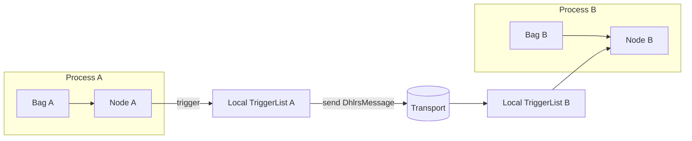

# D‑HLRS — Distributed Hierarchical Lazy Reactive Store

This document describes how **Genro‑HLRS** extends into a distributed setting,
becoming **D‑HLRS**.

## 1. From HLRS to D‑HLRS

Base HLRS defines:

- `Bag` / `BagNode` tree
- Resolver (lazy evaluation, sync/async, caching)
- TriggerList (reactive propagation)
- Path syntax inside a single process

D‑HLRS keeps the **same semantics**, but adds:

1. **Global addressing**
2. **Transport abstraction**
3. **Remote triggers and resolvers**
4. **Consistency and conflict handling policies**

## 2. Global Addressing

A value or node in D‑HLRS can be addressed as:

```
<machine_id>/<process_id>/<store_id>/<bag_path>
```

Where:

- `machine_id` — logical or physical node identifier.
- `process_id` — process or runtime identifier.
- `store_id` — identifies a specific HLRS instance inside that process.
- `bag_path` — the local HLRS path (`aaa.bbb.#2/parent?color`, etc.).

Example:

```text
eu-west-1a/worker-07/orders-store/root.orders.#3.status
```

## 3. Transport Abstraction

D‑HLRS does **not** fix a single transport.  
Instead, it assumes a pluggable transport layer, e.g.:

- NATS
- Redis streams
- Kafka
- WebSockets
- Custom TCP / HTTP

The only requirement is to support **messages** of the form:

```text
DhlrsMessage {
    msg_id: string
    source: {machine_id, process_id, store_id}
    target: {machine_id, process_id, store_id}
    path: string           # bag_path
    op: string             # "setItem", "setValue", "setAttr", "invalidate", ...
    payload: any
    reason: string         # used to correlate + avoid loops
    timestamp: float
}
```

## 4. Remote Operations

Typical remote operations:

- **Remote write**: `setItem` / `setValue` / `setAttr` on a remote HLRS.
- **Remote cache invalidation**: request that a resolver is re‑run elsewhere.
- **Remote subscription**: ask to receive certain trigger events across nodes.

### Example flow

1. Node A decides to update `orders.#3.status` in node B.
2. A sends a `DhlrsMessage` with op `"setItem"` and a reason `"sync-from-A"`.
3. B applies `setItem`, firing local + Bag triggers.
4. Triggers may in turn emit new D‑HLRS messages, but reason is used to avoid loops.

## 5. Event Propagation Across Nodes

Locally, HLRS propagates:

1. Node triggers
2. Bag triggers level 0
3. Parent Bag triggers (level -1, -2...)

In D‑HLRS, we extend this with **remote listeners**:

- A trigger may decide to emit a D‑HLRS message.
- Remote HLRS instances apply the operation and fire their own local trigger chains.
- `reason` and `msg_id` are used to de‑duplicate and break cycles.

### Mermaid Overview



## 6. Consistency Model

D‑HLRS is designed to be **eventually consistent** by default:

- Each node applies operations in message order per source.
- Conflicts can be:
  - last‑write‑wins,
  - version‑vector based,
  - domain‑specific resolution.

The spec leaves consistency policy pluggable, but **requires**:

- operations to be **idempotent** where possible,
- messages to carry a `reason` + `msg_id` to identify duplicates,
- clear rules on what happens when operation X arrives twice.

## 7. Remote Resolvers

Resolvers in D‑HLRS can:

- run locally and just emit local updates,
- or act as **remote clients**, fetching from other HLRS instances.

Example resolver:

```python
async def remote_profile_resolver(node):
    user_id = node.attributes["user_id"]
    # ask remote D-HLRS node for /profiles.<user_id>
    profile = await dhlrs_client.get_value(
        machine_id="profile-cluster",
        process_id="svc-01",
        store_id="profiles",
        path=f"profiles.{user_id}"
    )
    return profile
```

When this resolver completes and sets the value, the usual HLRS trigger chain fires.

## 8. Summary

D‑HLRS is **not** a new data model;  
it is a **distributed extension** of the HLRS semantics:

- same Bag + BagNode structure,
- same Path syntax,
- same Resolver and Trigger logic,
- plus:
  - global addressing,
  - transport‑agnostic messaging,
  - remote events and resolvers,
  - pluggable consistency.

A good mental model:

> **HLRS is the local algebra.  
> D‑HLRS is the networked runtime.**
