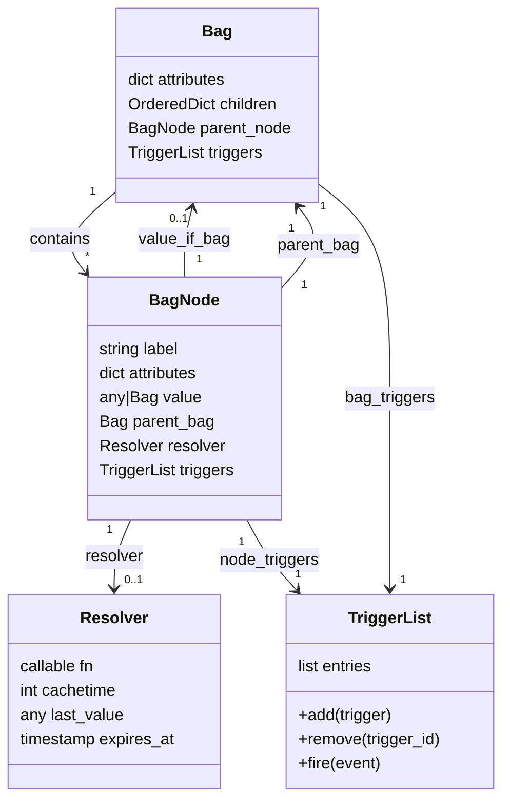

# Reactive Hierarchical Bag (RHB) — Overview

This documentation describes the **Reactive Hierarchical Bag (RHB)** system:  
a hierarchical, reactive data structure designed to be implemented in both **Python** and **JavaScript**.

RHB combines:

- A **tree of nodes** (Bag + BagNode)
- **Triggers** that react to structural and value changes
- **Resolvers** (sync/async) with caching and invalidation
- A rich **path syntax** for navigation and addressing
- A design that is suitable for **distributed, multi-language, multi-process** architectures.

## Core Concepts

At the heart of the system there are four main entities:

1. **Bag** – hierarchical container of nodes.
2. **BagNode** – individual node in the tree (label + attributes + value).
3. **Resolver** – computes node values (sync or async) with optional caching.
4. **TriggerList / Trigger** – manages callbacks for structural and value changes.

### High‑Level Mermaid Diagram

## Design Goals

- **Deterministic behaviour** for structural operations.
- **Safe reads**: reads never raise, but return `None` or a provided default.
- **Extensibility**: easy to plug in distributed transport or multi‑process setups.
- **Symmetric semantics** in Python and JavaScript.
- **No duplicate labels** inside a Bag (for predictable addressing and merging).

The following documents go into detail for each class and subsystem.
