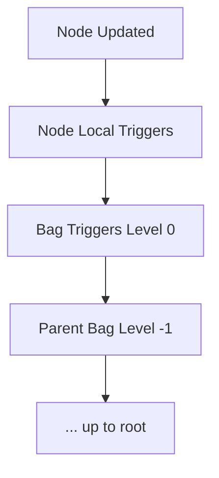

# 04 — Trigger System (Complete)

## 1. Overview
Triggers make the RHB reactive. They fire on:
- node insert
- node delete
- node update (value and/or attributes)

## 2. Trigger Registration

Triggers can be defined on:
- Bags → receive insert/delete/update from subtree
- Nodes → receive updates of the node itself only

Triggers have:
- unique ID
- callback function
- registration order preserved
- removable by ID

## 3. Callback Signatures

### 3.1 Insert
```
on_insert(where, position, inserted_node, reason, level)
```

### 3.2 Delete
```
on_delete(where, position, deleted_node, reason, level)
```

### 3.3 Update
```
on_update(node, old_value, old_attrs, info, reason, level)
```

Where `info` is:
```
{
  value_changed: bool,
  attributes_changed: bool
}
```

## 4. Propagation Rules

1. Node triggers fire first.
2. Bag triggers at level 0.
3. Parent Bag triggers (level -1).
4. Continue to root.

Never loops: `reason` prevents recursion.

## 5. Event Flow (Mermaid)


